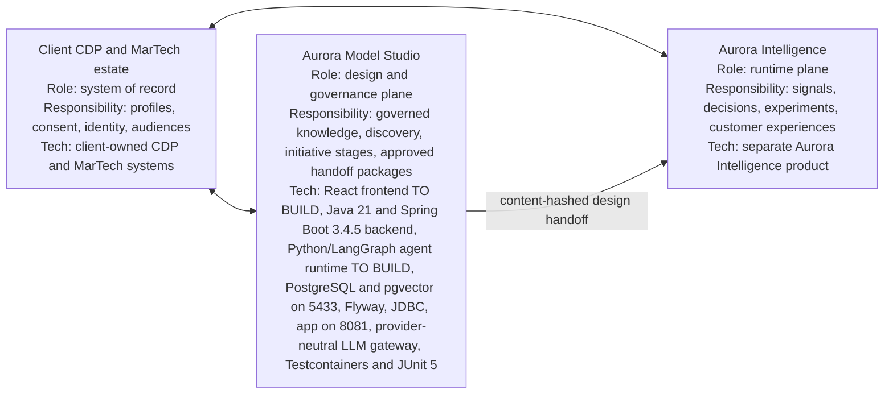
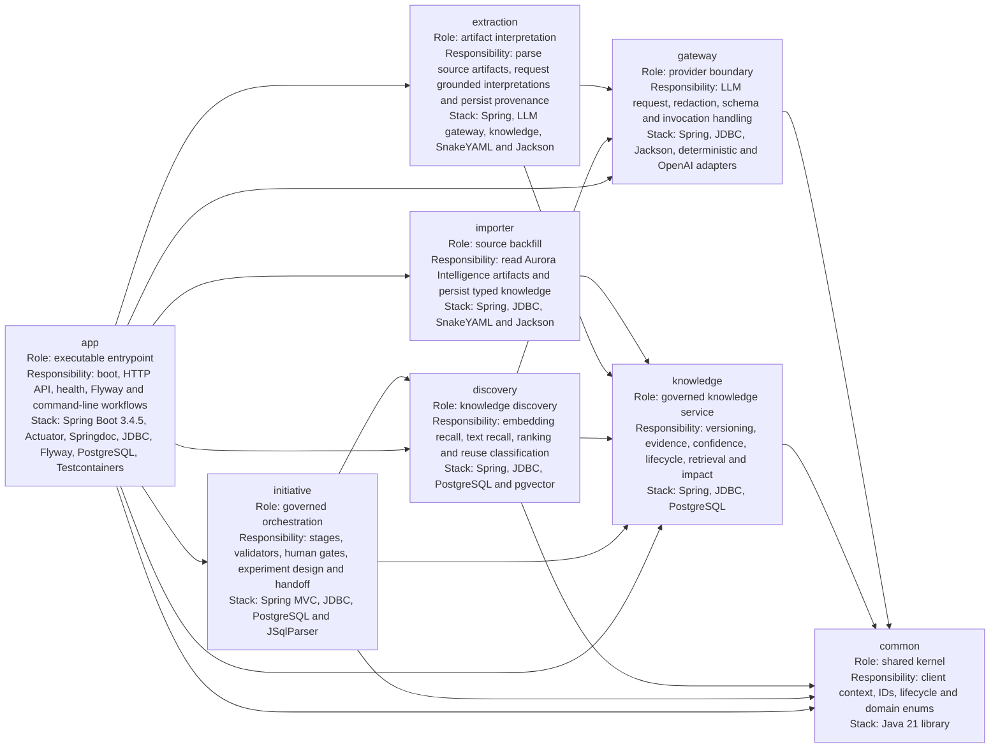
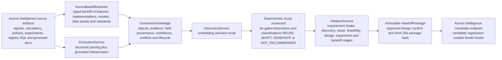
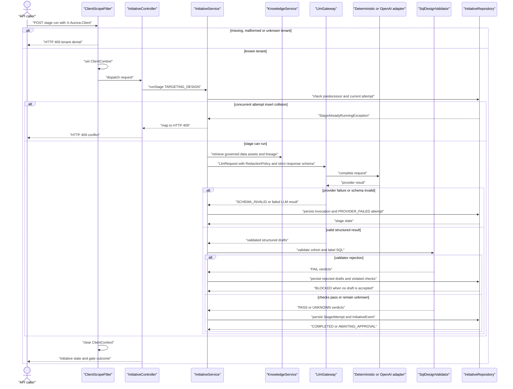
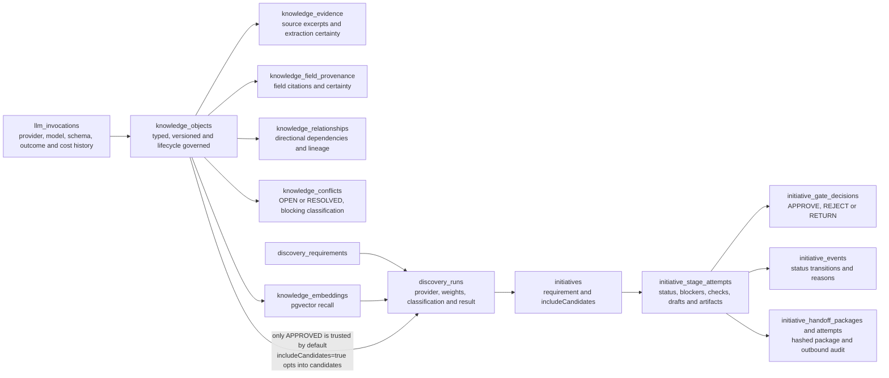
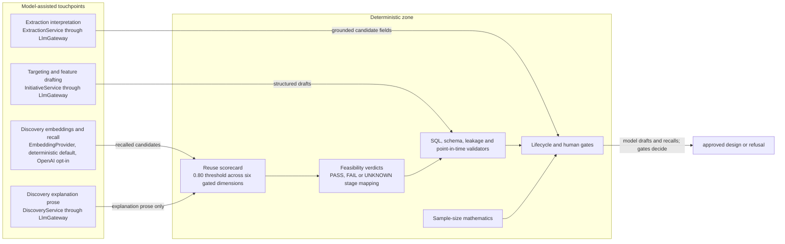
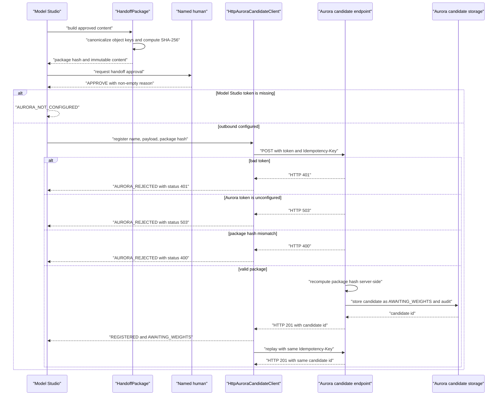

# Aurora Model Studio architecture

[See the standalone platform map](model-studio-platform.md) for the layered product view; this document remains the code-level architecture view.
[See the detailed layer designs](design/README.md) for implementation contracts and audit detail.
[See the implementation specifications](design/impl/README.md) for typed build contracts and sequence.
[See ADR 0002](adr/0002-per-layer-technology.md) for the per-layer technology rule.

Aurora Model Studio is the design and governance plane for customer-intelligence
artifacts. It imports and interprets source material, retrieves governed knowledge,
orchestrates human-gated initiative stages, and sends an immutable design package to
Aurora Intelligence. It does not train or serve models and does not own client
profiles.

**How to use this guide.** Start at Level 0 for the system boundary, use Level 2 for
the end-to-end flow, Level 3 for one request, Level 4 for persistence, Level 5 for
the model-versus-gate boundary, and Level 6 for the outbound seam. Level 1 explains
the module structure.

## Level 0 — system context



The client estate remains the system of record. The bidirectional arrows are adapter
seams, not replacement: Model Studio and Aurora Intelligence do not become the owner
of client profiles. Model Studio governs designs and candidate registration; Aurora
owns runtime execution after the handoff. Neither product trains a model.

## Level 1 — Maven modules and dependency direction

The root `pom.xml` is the Maven reactor aggregator (`packaging` is `pom`) and lists
the eight modules. The `app` module is the Spring Boot executable entrypoint and
runtime aggregator: `ModelStudioApplication` scans the product modules, Flyway runs
from the app, and the repackaged artifact listens on port `8081`.

The diagram arrows mean “the module at the tail depends directly on the module at the
head.” The arrows are the dependency direction declared by the module POMs.



The enforced rule is an acyclic layering: shared types sit at the bottom, providers
and persistence are reused by higher-level services, and only `app` assembles the
runtime. `common` depends on no product module. A code-level nuance is important:
`common` is a direct dependency of `gateway`, `knowledge`, `discovery`, `initiative`,
and `app`, but `importer` and `extraction` receive it transitively through their
declared dependencies (`knowledge`, and `gateway` plus `knowledge`, respectively).
Thus “everything depends on `common`” is true transitively, not as eight direct POM
edges.

## Level 2 — end-to-end product flow

The importer reads an Aurora Intelligence checkout in place; it does not copy or
modify that repository. The extraction path parses selected YAML, Java, SQL and
Markdown artifacts, then uses the gateway only for grounded interpretation. Both
paths write versioned knowledge and evidence through the knowledge service.



The initiative enum contains nine stages:
`REQUIREMENT_INTAKE`, `KNOWLEDGE_DISCOVERY`, `REUSE_DECISION`,
`DATA_FEASIBILITY`, `TARGETING_DESIGN`, `FEATURE_DESIGN`, `CANDIDATE_BUILD`,
`EXPERIMENT_DESIGN`, and `HANDOFF`. `CANDIDATE_BUILD` is represented as
`OUT_OF_SCOPE`; Model Studio creates no trained candidate.

Detailed behavior is split into [the knowledge model](knowledge-model.md),
[extraction](extraction.md), [discovery](discovery.md),
[targeting and feature design](targeting-feature-design.md), and
[experiment design and handoff](experiment-design-and-handoff.md).

## Level 3 — one targeting-design request

Targeting design shows the complete request path. `ClientScopeFilter` requires a
known UUID in `X-Aurora-Client`, places it in `ClientContext` for the request, and
clears it afterward. Every repository query and write uses that context.



The gateway retries retryable adapter results up to two times and performs the strict
schema check before `InitiativeService` sees a successful result. A non-successful
result has no deterministic fallback in the targeting path: the stage is recorded as
`PROVIDER_FAILED`. SQL validation is deterministic and covers read-only parsing,
governed references, output contracts, point-in-time bounds and target leakage.

The controller maps `StageAlreadyRunningException` to `409`. The ordinary status
guard for an attempt already marked `IN_PROGRESS` or `AWAITING_APPROVAL` raises an
`IllegalStateException`, which the controller maps to `400`; the `409` path is the
concurrent insert race.

The provider boundary is detailed in [LLM gateway](llm-gateway.md), and the design
validators are detailed in [targeting and feature design](targeting-feature-design.md).

## Level 4 — data model and lifecycle

Knowledge objects are immutable in content once approved. New source material creates
another version; approval supersedes the previous approved version for the same
client and key. Confidence is computed from known evidence and populated attributes;
unknown signals are omitted and weights are renormalized. An open blocking conflict
warns and caps confidence at `0.5`.



The lifecycle is:

```text
EXTRACTED → PENDING_REVIEW → APPROVED → SUPERSEDED or DEPRECATED
```

Only `APPROVED` knowledge is trusted by default. Candidate retrieval requires
`includeCandidates=true`; the same opt-in is carried by discovery and initiatives.
The unique approved-per-client-and-key index prevents two approved versions at once.

Database-level enforcement is provided by Flyway migrations `V1` through `V14`:

- `knowledge_audit` is append-only through `knowledge_audit_append_only`, and
  `llm_invocations` is append-only through `llm_invocations_append_only`.
- `discovery_requirements` and `discovery_runs` are append-only through their
  database triggers.
- `initiative_events` and `initiative_gate_decisions` are append-only through their
  database triggers.
- `initiative_handoff_attempts` is insert-only through its database trigger.
- Approved `knowledge_objects` cannot be edited in place; the
  `knowledge_approved_guard` permits only `SUPERSEDED` or `DEPRECATED` lifecycle
  transitions while protecting approved content.
- Composite foreign keys repeat `client_id` on knowledge and initiative relationships,
  preventing cross-client references at the database layer.

The human-gate trigger trusts the `aurora.initiative_gate_actor` session variable
that the API sets immediately before inserting a decision. This protects against
accidental machine writes through the normal path; it is not protection against an
adversary who can write to the database and set that variable. The approver identity
is caller-asserted and unverified (`actorIdentityVerified:false` is disclosed in the
API), so a caller may supply any name. The exact governed machine-identity check is
only a self-approval guard against the orchestrator's own identity rubber-stamping a
human gate it created; it does not verify arbitrary human identity.

## Level 5 — where AI stops and gates begin

The application has four model-assisted touchpoints: extraction interpretation,
discovery embeddings and recall, discovery explanation prose, and targeting plus
feature drafting. The main-code `LlmGateway` calls are exactly four calls across
three services: `ExtractionService`, `DiscoveryService`, and `InitiativeService`
(targeting and feature design). Discovery embeddings and recall use `EmbeddingProvider`,
not `LlmGateway`; the configured default is `DeterministicEmbeddingProvider`, while
`OpenAiEmbeddingProvider` is opt-in.



The six gated reuse dimensions are `targetAlignment`, `populationAlignment`,
`horizonAlignment`, `featureAvailability`, `dataAvailability`, and
`implementationAvailability`. `evidenceStrength` is present in the scorecard and
weighted in configuration, but it is not one of those six gated dimensions.

The deterministic zone also includes strict response-schema validation, SQL
read-only and governed-reference checks, target-leakage checks, point-in-time checks,
feasibility mapping, deterministic sample-size calculation, lifecycle transitions,
and explicit human decisions. The model drafts or recalls material; the gates decide
what can proceed.

## Level 6 — outbound seam

The handoff is an approved, immutable design package, not a trained model. The
`AuroraCandidateClient` abstraction is implemented by
`HttpAuroraCandidateClient`; Compose supplies the cross-container
`host.docker.internal` default and the shared write token.



The package contains the requirement trace, model name, targeting design and
validator verdicts, feature and data-asset references, experiment design, feasibility
checks, evidence, and declared observables. It deliberately excludes a trained model,
weights, evaluation, and expected lift. Aurora recomputes the hash before accepting
the package and stores the result separately as a candidate with status
`AWAITING_WEIGHTS`; it is not a `model_versions` row, is not `TESTED`, and is not
servable.

Weights and evaluation come from client MLOps, which may later produce a tested
downstream model. Model Studio does not train, evaluate, deploy, serve, or monitor
that model. The outbound contract and a runnable walkthrough are documented in
[handoff contract](handoff-contract.md) and [handoff walkthrough](handoff-walkthrough.md).

The current embedding schema has a real provider limitation: PostgreSQL stores
`vector(32)`, while OpenAI `text-embedding-3-small` returns 1536 dimensions. There is
no embedding-model or embedding-version column. Enabling OpenAI embeddings therefore
requires a migration and design change rather than only a configuration switch.

## Tenant and governance boundaries

The required `X-Aurora-Client` header is validated against the configured client IDs;
missing, malformed, and unknown IDs return HTTP 400. `ClientContext` scopes repository
queries and writes. Each knowledge and initiative table carries `client_id`, and
composite foreign keys repeat that boundary for child references.

Local actors are self-declared and unverified. They are recorded for demo traceability
only and do not constitute authentication, authorization, or an audit identity.

## Honest limits

- `CANDIDATE_BUILD` is permanently out of scope in Model Studio.
- Model Studio does not train models or provide evaluation, serving, or monitoring.
- Client MLOps owns weights, evaluation, deployment, and runtime operations.
- Actors are self-declared and unverified.
- The leakage validator has an open false negative for human-readable event spellings.
- Aurora Intelligence remains a separate product and source system; the importer
  reads its checkout in place without modifying it.
