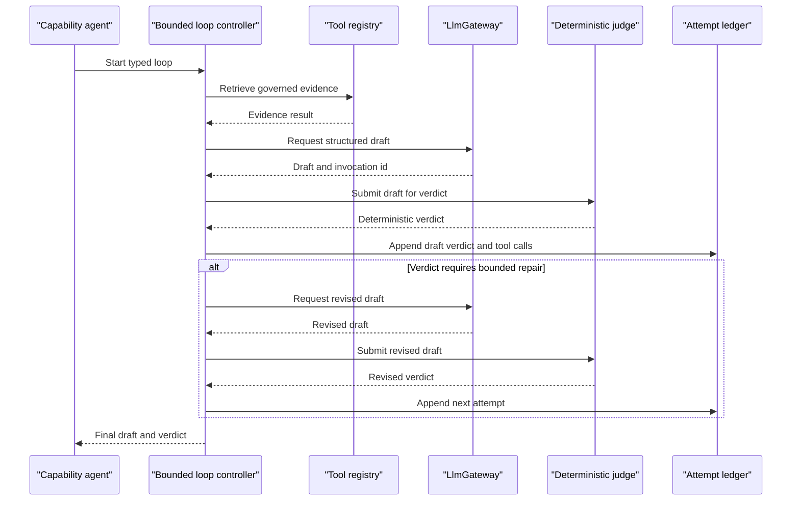

# Cross-cutting: Agent platform (rail across layers 2 and 3)

## 1. Purpose

The Agent Platform is shared infrastructure every agent in Layers 2 and 3
calls for structured model calls, embeddings, tools, bounded loops and evidence
accounting. It is not a layer or a pipeline stage, an orchestrator of record, a
provider-specific application, or a replacement for deterministic validators.

## 2. Status

**Gateway BUILT; the rest is TO BUILD.** `LlmGateway` and
`EmbeddingProvider` are implemented. Tool registration, bounded loop control,
an attempt ledger and evidence-policy enforcement do not exist.

## 3. Components

| component | responsibility | implementing class/table | notes |
| --- | --- | --- | --- |
| Provider boundary | Redact inputs, request structured output, retry retryable responses and record invocation | `LlmGateway`, `GatewayService`, `llm_invocations` | Application call is single-shot; one physical provider call may be retried |
| Embedding boundary | Produce recall vectors | `EmbeddingProvider`, `DiscoveryEmbeddingWriter` | Deterministic default; OpenAI opt-in |
| Tool registry | Expose retrieval, catalog query, feature build and validators | TO BUILD | Tools must be capability-scoped and auditable |
| Bounded Loop Controller | Hold typed loop state and enforce attempt budget | TO BUILD | No unbounded autonomy |
| Attempt Ledger | Persist every draft, verdict and retry for replay | TO BUILD | Proposed DDL below |
| Evidence policy hook | Reject uncited agent input as threshold-satisfying evidence | TO BUILD | Current provenance storage is not enforcement |

## 4. Interfaces

Built Java interfaces:

```java
interface LlmGateway {
  LlmResult complete(LlmRequest request);
}

interface EmbeddingProvider {
  Embedding embed(String text);
}
```

`LlmRequest` carries `taskId`, prompt template identity, resolved inputs,
response schema, output limit, timeout, redaction policy and rendered prompt.
`LlmResult` carries invocation id, `LlmOutcome`, payload, message, token counts,
cost, latency and retry count. `LlmOutcome` is `OK`, `REFUSED`,
`SCHEMA_INVALID` or `FAILED`.

Proposed tool contract:

```java
interface Tool<I, O> {
  String name();
  O call(ToolCall<I> call);
}

record ToolCall<I>(String callId, String capability, I input) {}

record LoopBudget(int maxAttempts, int maxToolCalls) {}

record LoopState<I, O>(
    String loopId, I input, O latestDraft, List<?> verdicts, int attempt) {}
```

The tool registry must expose governed retrieval, catalog or warehouse query,
feature build and `SqlDesignValidator` or feature validators. These are
proposed interfaces only.

## 5. Data model

The built invocation table from `V3__llm_invocations.sql` is:

```text
llm_invocations(
  id, client_id, task_id, provider, model, prompt_template_id,
  prompt_template_version, prompt_hash, schema_id, input_tokens,
  output_tokens, cost, latency_millis, retry_count, outcome, recorded_at
)
```

It has an outcome check constraint, a client-scoped unique key and an
append-only trigger. It stores a prompt hash, not the prompt or response.

Proposed attempt ledger:

```sql
create table agent_attempts (
  id uuid primary key,
  client_id uuid not null,
  loop_id uuid not null,
  capability varchar(80) not null,
  attempt integer not null,
  input jsonb not null,
  draft jsonb,
  verdicts jsonb not null default '[]'::jsonb,
  tool_calls jsonb not null default '[]'::jsonb,
  outcome varchar(40) not null,
  created_at timestamptz not null default now(),
  unique (client_id, loop_id, attempt)
);
```

The future ledger must reject update and delete, use composite client foreign
keys for initiative linkage, and retain enough typed state to replay a loop.
No such table exists today.

## 6. Main path



## 7. Deterministic vs agent split

The agent chooses how to gather evidence and how to phrase a draft. Tools may
return observations and validator verdicts. The loop controller owns the fixed
budget and typed transitions. Deterministic code owns thresholds, arithmetic,
schema and SQL guards, lifecycle transitions and gate outcomes.

LangGraph, if adopted, sits inside a bounded capability loop on the Python
side. It does not replace `LlmGateway`, own workflow state, or become the
provider boundary. AutoGen is rejected; LangChain remains low priority.

## 8. Failure and refusal behaviour

- Missing schema or invalid payload becomes `SCHEMA_INVALID`.
- `REFUSED` or non-retryable provider failures stop the gateway call.
- Retryable failures may be attempted up to the current `GatewayService` limit
  of three physical attempts; `retryCount` is recorded.
- Tool permission, query-limit or validator failures return a structured
  refusal and consume a bounded attempt according to the future contract.
- Exhausted loop budget returns the last draft and unresolved verdicts; it does
  not silently approve.
- Uncited evidence resolves `UNKNOWN` once the future policy hook is built.

## 9. Tech stack

The built boundary is Java 21, Spring Boot 3.4.5, JDBC and PostgreSQL. It uses
provider-neutral `LlmGateway`, deterministic and OpenAI adapters, Java
`HttpClient` for the OpenAI embedding adapter, and Flyway for the schema.
Future bounded agent loops may use Python 3.12, FastAPI and optionally
LangGraph, while deterministic judges remain in Java.

## 10. Open questions / risks

- Tool authentication and per-tool client scoping need a concrete contract.
- Attempt-ledger retention and replay semantics are not yet decided.
- Prompt hashes prove identity, not semantic correctness.
- Provider retries can create multiple physical calls for one application
  call site and must remain visible in the ledger.

## 11. Implementation specifications

| Component | Implementation specification | What the specification adds |
| --- | --- | --- |
| Agent platform runtime | [Agent platform runtime](impl/agent-platform-runtime.md) | Typed tools, bounded loops, append-only attempt records and citation enforcement |

Provider-specific tool implementations and the final retention policy have no
separate implementation specification yet. The runtime spec defines the
governance boundary and persistence contracts while those deployment details
remain undecided.
