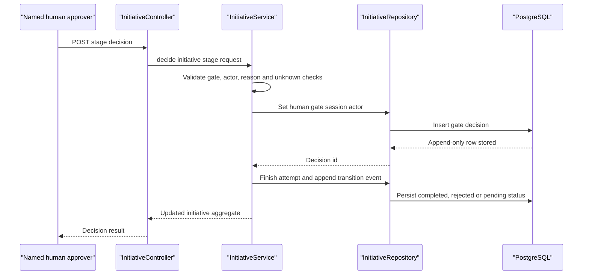

# Cross-cutting: Human gate (rail between proposal and state change)

_Named approver, reason recorded, no self-approval. Every proposal in Layers 2
and 3 stops here._

## 1. Purpose

The Human Gate records an explicit human decision between an agent proposal and
workflow state change. It is responsible for validating the decision,
recording the named actor and reason, and applying the resulting lifecycle
transition; it is not an authentication provider, an agent, a deterministic
judge, or a substitute for the Layer 3 hash-bound feature-set contract.

## 2. Status

**BUILT for governed initiative stages; Layer 3 feature-set binding is TO
BUILD.** `InitiativeService.decide` and the initiative controller implement the
current gate mechanics. The future execution gate must bind approval to an
exact versioned feature set and hash.

## 3. Components

| component | responsibility | implementing class/table | notes |
| --- | --- | --- | --- |
| Gate API | Accept and validate a decision for a stage awaiting approval | `InitiativeController`, `InitiativeService.decide` | `POST /api/initiatives/{id}/stages/{stage}/decision` |
| Gate verbs | Transition the stage after human input | `initiative_gate_decisions`, `InitiativeService` | `APPROVE`, `REJECT` or `RETURN` |
| Named actor and reason | Record who decided and why | `GateDecisionRequest`, `initiative_gate_decisions` | Actor and reason must be non-blank and are caller-supplied |
| Unknown-check acceptance | Require explicit acceptance of every relevant UNKNOWN check when approving | `acceptedUnknownChecks`, `InitiativeService` | Applies to UNKNOWN checks on data, targeting, feature and experiment gates |
| No-self-approval guard | Reject the known orchestrator identity from approving its own gated work | `InitiativeActors` | Exact machine-identity set contains only `initiative-orchestrator`; not authentication |
| Append-only decision record | Preserve each gate decision and prevent mutation | `initiative_gate_decisions` | Database trigger rejects update and delete |
| Layer 3 hash-bound gate | Approve the exact versioned feature set before ML execution | TO BUILD | See [Layer 3 execution capabilities](layer-3-execution-capabilities.md) |

## 4. Interfaces

The built decision route is:

```text
POST /api/initiatives/{id}/stages/{stage}/decision
```

Its request shape is:

```json
{
  "decision": "APPROVE",
  "actor": "named-human",
  "reason": "Reviewed the displayed evidence",
  "acceptedUnknownChecks": ["data-asset-resolution"]
}
```

`InitiativeService.decide` requires a gated stage, a non-blank actor and
reason, and one of the three verbs. When approving relevant UNKNOWN
feasibility checks, `acceptedUnknownChecks` must equal the complete sorted set
of UNKNOWN check names. The response is the updated `Initiative` aggregate.

The current implementation sets the `aurora.initiative_gate_actor` session
setting to `human` before inserting the row. A future Layer 3 execution
contract must carry the approved feature-set id, version and content hash
through the gate and into the execution request; its detailed hash contract
is specified in the linked Layer 3 design.

## 5. Data model

`initiative_gate_decisions` is created by
`V6__initiatives_and_orchestration.sql`:

```text
initiative_gate_decisions(
  id, client_id, initiative_id, stage_attempt_id, stage, decision,
  actor, actor_verified, reason, accepted_unknown_checks, created_at
)
```

The decision has a database check constraint limiting `decision` to
`APPROVE`, `REJECT` and `RETURN`. It has composite client-scoped foreign keys
to the initiative and stage attempt. The
`initiative_gate_decisions_append_only` trigger rejects update and delete.
The `initiative_gate_human_guard` trigger requires the
`aurora.initiative_gate_actor` session setting to be `human` and rejects
`actor_verified = true`.

The Layer 3 feature-set approval records are proposed in
[Layer 3 execution capabilities](layer-3-execution-capabilities.md). They
must retain the exact canonical feature-set content hash alongside the
decision reference.

## 6. Main path



## 7. Deterministic vs agent split

Agents may prepare a proposal and explain the evidence shown to the approver.
The service deterministically checks the stage, actor, verb, reason and
accepted UNKNOWN checks, then records the decision. The approver decides
whether to accept, reject or return the proposal; the agent cannot approve its
own work or write the decision. Layer 3 additionally requires deterministic
hash verification before any execution begins.

`InitiativeActors` is an exact-set self-approval guard: it recognises only the
literal `initiative-orchestrator` after trimming and lowercasing. It does not
authenticate the caller or prove that any other actor is human.

## 8. Failure and refusal behaviour

- A non-gated stage raises `ValidationException` and maps to HTTP 400.
- A missing, blank, overlong or control-character actor or reason is rejected
  by `ValidationException` and maps to HTTP 400.
- A known machine identity raises `ValidationException`; the current exact set
  contains only `initiative-orchestrator`.
- An unsupported verb raises `ValidationException`; only `APPROVE`, `REJECT`
  and `RETURN` are accepted.
- Approving a stage that is not `AWAITING_APPROVAL` raises
  `IllegalStateException` and maps to HTTP 400.
- Missing or incomplete `acceptedUnknownChecks` rejects approval of relevant
  UNKNOWN checks; non-empty values on other decisions are also rejected.
- Missing initiative or stage attempt maps to HTTP 404.
- Database attempts to mutate a gate row are refused by the append-only
  trigger. A forged or missing session actor is refused by the human-gate
  trigger; the session setting is defence in depth, not authentication.
- A Layer 3 feature-set hash mismatch must return
  `FEATURE_SET_HASH_MISMATCH` before client data is touched.

## 9. Tech stack

The built gate uses Java 21, Spring Boot 3.4.5, Spring MVC, JDBC, PostgreSQL
and Flyway. Database constraints and triggers protect the decision record.
Future Layer 3 binding is part of the Python 3.12 and FastAPI execution seam,
with Java retaining ownership of the gate, hash, threshold and promotion
policy.

## 10. Open questions / risks

- Actor identity remains caller-asserted and unverified until authentication is
  integrated.
- The database session-setting guard can be forged by a database-capable
  caller.
- The exact UI evidence and acknowledgement contract is not yet defined.
- Layer 3 needs cross-language tests proving the approved hash is preserved.
