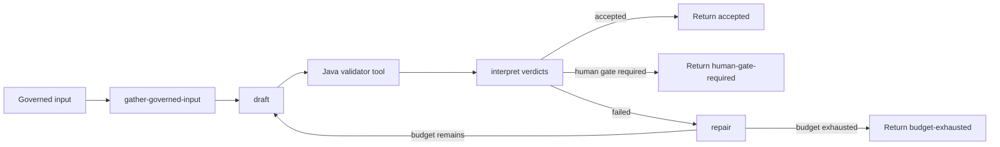

# Python agent runtime

**Status: TO BUILD.** No Python agent service exists today. This
specification adds the bounded LangGraph execution runtime for new capability
agents; it does not move governance, verdicts, persisted initiative state or
the system of record out of Java.

Realises [the agent platform rail](../cross-cutting-agent-platform.md), part of [the implementation specification index](README.md); prerequisites: [Java agent platform runtime](agent-platform-runtime.md) and [Java-Python execution seam](java-python-seam.md).

## 1. Scope

Build an authenticated Python service that runs one bounded LangGraph
`StateGraph` per capability. The service gathers governed inputs, asks the
Java runtime to execute tools and complete prompts, interprets Java validator
verdicts, repairs a draft and returns a bounded outcome. LangGraph plans and
iterates; Spring Boot holds the verdict, the ledger and persisted state.

The service has no governance-schema credentials, no provider credentials and
no authority to write a stage status or gate decision. Its checkpointer, if
enabled, is working memory only and is never the system of record.

## 2. Module and package layout

Create the TO BUILD project at `python/agent_service/`, alongside the already
specified Python services:

```text
python/
  common/
  agent_service/
    pyproject.toml
    agent_service/
      __init__.py
      main.py
      config.py
      seam_client.py
      graph_factory.py
      graph_state.py
      capabilities/
        targeting.py
        feature.py
        discovery.py
        reuse.py
      tests/
```

Use FastAPI and uvicorn for the authenticated HTTP process, Pydantic v2 for
request, response and graph-boundary models, and LangGraph for bounded graph
execution. Exact dependency versions are selected at implementation time and
must be releases at least seven days old. Reuse `python/common/` for
canonicalisation and the Java-Python seam request/response models; do not
duplicate those models in `agent_service`.

## 3. Types

Use typed Pydantic models for the service boundary and typed state for every
graph:

```python
class CapabilityState(TypedDict):
    loop_id: UUID
    initiative_id: UUID
    stage_attempt_id: UUID
    capability: str
    attempt: int
    draft: dict[str, Any] | None
    verdicts: list[dict[str, Any]]
    citations: list[dict[str, Any]]
    tool_calls: int
    termination: str | None

class AgentRunRequest(BaseModel):
    loop_id: UUID
    initiative_id: UUID
    stage_attempt_id: UUID
    capability: str
    budget: LoopBudget
    governed_input: dict[str, Any]

class AgentRunResponse(BaseModel):
    loop_id: UUID
    draft: dict[str, Any] | None
    verdicts: list[dict[str, Any]]
    termination: Literal[
        "ACCEPTED", "HUMAN_GATE_REQUIRED", "BUDGET_EXHAUSTED",
        "PROVIDER_REFUSED", "PROVIDER_FAILED", "TOOL_REFUSED",
        "VALIDATION_FAILED"
    ]
    attempts: int
    tool_calls: int
    last_invocation_id: UUID | None
```

The actual seam models are shared from `python/common/` and must serialise to
the exact Java request and response shapes. Python treats Java validator
verdicts as structured data; it does not recalculate their meaning.

## 4. Behaviour

Each capability constructs one LangGraph `StateGraph` with nodes along these
lines:

```text
gather-governed-input
  -> draft
  -> validate-via-java-validator-tool
  -> interpret-verdicts
  -> repair
  -> validate-via-java-validator-tool
```

The graph has conditional edges that terminate on `accepted`,
`human-gate-required` or `budget-exhausted`. A capability may add a
specialised gathering or repair node, but prompts, repair strategy and graph
orchestration stay in Python while deterministic judges and validator logic
stay in Java.

Java hands the graph a budget. The graph uses that budget as its attempt and
tool-call ceiling and sets LangGraph's recursion limit to a matching bound.
Both controls are required; neither alone is load-bearing. Before each
attempt, Python appends the input and after each tool call it appends the
result through Java. If Java refuses an append, the graph terminates and does
not continue locally.



## 5. Schema

No Python migration is introduced. Java V15 `agent_attempts` and
`agent_tool_calls` remain the append-only records, and V16
`capability_loop_state` remains the Java current-state projection. A
LangGraph checkpointer may retain a serialised working state for one running
graph or debugging, but it is not authoritative and must not be used to
resume past a Java budget refusal.

Every completion and validator result is associated with the loop and
attempt identifiers supplied by Java. The service keeps no second durable
ledger.

## 6. HTTP contract

The service accepts an authenticated capability-run request from Java's
initiative path and calls the Java inbound routes described in
`agent-platform-runtime.md`:

| Direction | Route | Purpose |
| --- | --- | --- |
| Java to Python | `/internal/agent/runs` | Start one bounded capability graph |
| Python to Java | `/internal/agent/tools/dispatch` | Execute one registered governed tool |
| Python to Java | `/internal/agent/completions` | Proxy one completion through `LlmGateway` |
| Python to Java | `/internal/agent/attempts` | Append one attempt to V15 |
| Python to Java | `/internal/agent/tool-calls` | Append one tool call to V15 |

Python sends `X-Aurora-Studio-Token`, `X-Aurora-Client`,
`Idempotency-Key`, `X-Aurora-Content-Hash` and `Content-Type` according to the
seam contract. The client header is bound to the deployment token and is not a
free request-body field. No Python route exposes governance-schema access.

## 7. Configuration

| Property | Type | Default | Validation |
| --- | --- | --- | --- |
| `AGENT_SERVICE_JAVA_BASE_URL` | URL | required | authenticated HTTPS in production |
| `AGENT_SERVICE_TOKEN` | secret | required | deployment secret; never provider key |
| `AGENT_SERVICE_CONNECT_TIMEOUT_SECONDS` | `int` | `3` | 1–300 |
| `AGENT_SERVICE_REQUEST_TIMEOUT_SECONDS` | `int` | `10` | 1–300 |
| `AGENT_SERVICE_RECURSION_LIMIT_MULTIPLIER` | integer | `2` | positive |
| `AGENT_SERVICE_CHECKPOINT_MODE` | enum | `DISABLED` | `DISABLED` or `DEBUG_ONLY` |

There are no governance database credentials, provider keys or direct provider
endpoints in this configuration. A completion always targets the Java
gateway route.

## 8. Deterministic rules

Python must obey these boundary rules; Java enforces the correctness-critical
ones:

| Identifier | Rule |
| --- | --- |
| `AGENT-NO-GOVERNANCE-DB` | The process has no governance-schema database credentials. |
| `AGENT-NO-PROVIDER-CALL` | Every completion goes through Java `LlmGateway`; Python has no provider key. |
| `AGENT-JAVA-VALIDATOR` | Every verdict comes from a Java validator tool. |
| `AGENT-NO-THRESHOLD-ARITHMETIC` | Python does not calculate thresholds, scorecards or correctness-critical numbers. |
| `AGENT-NO-STAGE-WRITE` | Python cannot write stage status or gate decisions. |
| `AGENT-CITATION-PRESERVED` | An uncited value is sent to Java as `UNKNOWN`, never invented to satisfy a judge. |
| `AGENT-STOP-ON-REFUSAL` | The graph terminates when Java refuses a dispatch or append. |
| `LOOP-ATTEMPT-BOUND` | Java refuses attempt appends after the recorded budget is spent. |
| `LOOP-TOOL-BOUND` | Java refuses tool dispatch or append after the recorded tool budget is spent. |

LangGraph implements graph edges and local working state only. It does not
enforce the Java verdict, replace the Java ledger or choose a stage
transition.

## 9. Failure and refusal matrix

| Condition | Python outcome | Java record |
| --- | --- | --- |
| Java unavailable before or during a graph | Stop with `PROVIDER_FAILED`; do not retry around an unreachable seam | Python cannot record the outcome; Java's own dispatch timeout records the V18 failure row |
| Java tool refuses | End graph with `TOOL_REFUSED` | Refused `agent_tool_calls` and associated attempt |
| Java refuses an attempt or tool append for budget | End graph with `BUDGET_EXHAUSTED` | Prior V15 rows unchanged; refusal is returned to caller |
| LangGraph recursion limit is exhausted | End graph with `BUDGET_EXHAUSTED` | Final accepted append and V16 terminal projection |
| Pydantic request or response validation fails | End graph with `VALIDATION_FAILED` | Failed attempt with schema detail when Java is reachable |
| Java validator returns `UNKNOWN` | End with `HUMAN_GATE_REQUIRED` unless another failure applies | Verdict and citations in V15; Java owns gate status |
| Java gateway returns `REFUSED` | End with `PROVIDER_REFUSED` | `llm_invocations` and linked attempt |
| Uncited field reaches a judge | Preserve it as `UNKNOWN` | Citation failure and structured verdict in V15 |

No failure path converts an observation into a pass, resumes after a Java
refusal or writes an initiative stage or gate decision from Python.

## 10. Tests to write

Use pytest with HTTP contract tests around the Java seam:

- `BudgetTerminatingGraphStopsWithoutExtraAttempt`.
- `ToolRefusalEndsGraphRatherThanBeingRetriedAround`.
- `UncitedFieldArrivesAtJavaAsUnknown`.
- `JavaBudgetRefusalStopsGraphImmediately`.
- `JavaUnavailableMidGraphProducesBoundedFailure`.
- `RecursionLimitMirrorsJavaAttemptBudget`.
- `PydanticModelsSerialiseToExactJavaSeamShapes`.
- `NoProviderCredentialOrGovernanceDatabaseConfigurationIsAccepted`.
- `CheckpointerCannotResumePastJavaLedgerBudget`.

Where feature-set canonicalisation applies, reuse
`contracts/feature-set-hash-fixtures.json` and assert the shared
`python/common/` models produce the fixture hashes.

## 11. Acceptance criteria

- [ ] Each new bounded capability is a typed LangGraph `StateGraph`.
- [ ] Every completion and validator call crosses the authenticated Java seam.
- [ ] Java records each attempt and tool call and rejects spent budgets.
- [ ] Python has no governance-schema database credential or provider key.
- [ ] Thresholds, scorecards, verdicts, stage transitions and gate decisions
      remain Java-owned.
- [ ] Uncited values arrive at Java as `UNKNOWN`.
- [ ] A tool, append, provider or schema refusal terminates the graph without
      a bypass or automatic retry around the refusal.
- [ ] The LangGraph checkpointer, if enabled, is working memory only.

## 12. Open decisions

- **Direct provider calls:** LangChain callbacks could reduce seam latency and
  feed `llm_invocations`, but would move redaction and provider governance into
  Python. Recommendation: no; retain one audited Java egress.
- **Persistent checkpointer:** a durable LangGraph checkpointer could aid
  restart and debugging, but two state stores invite divergence from the Java
  ledger. Recommendation: disabled, or debugging-only.
