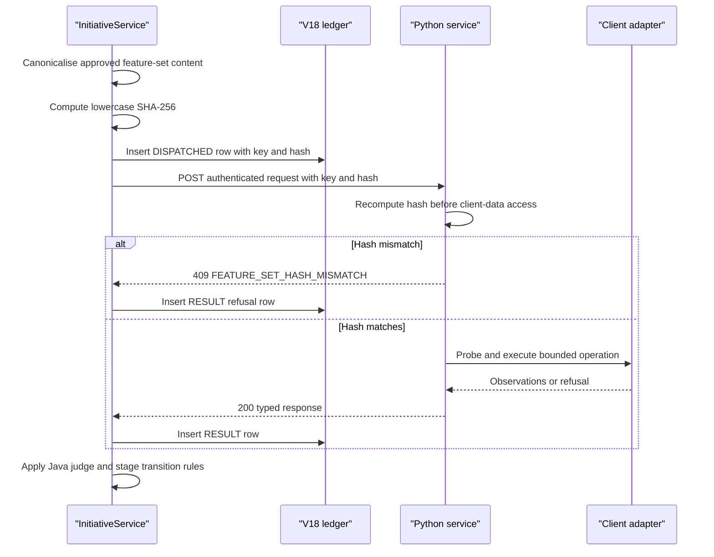

# Java-Python execution seam

**Status: TO BUILD.** This specification defines the authenticated contract
between the existing Java application, the proposed Python execution services
and the proposed Python agent service. It does not implement either service,
alter the existing gateway or move governance decisions into Python. Java
remains the authority for thresholds, sample-size mathematics, statistical
tests, promotion criteria, every verdict and every state transition.

Realises [Layer 3 execution capabilities](../layer-3-execution-capabilities.md), part of [the implementation specification index](README.md); prerequisite: [human-gate feature-set binding](human-gate-feature-set-binding.md) and [client adapters](layer-4-client-adapters.md).

## 1. Scope

Build a Java client and append-only dispatch record for Data & Feature, ML and
agent-service calls. The seam carries an idempotency key, canonical content
hash, typed request and typed response, and bounded failure codes. It must make
Python unavailability visible as a contained stage outcome rather than a
silent success. The contract also defines a shared canonicalisation fixture
set that both languages must pass. The Python agent direction returns to the
authenticated Java inbound API specified in [the agent platform runtime](agent-platform-runtime.md).

## 2. Module and package layout

Add the following TO BUILD Java files in the existing `initiative` module:

```text
initiative/src/main/java/com/aurora/studio/initiative/
  PythonExecutionClient.java
  HttpPythonExecutionClient.java
  PythonExecutionRequest.java
  PythonExecutionResponse.java
  ExecutionDispatch.java
  ExecutionFailure.java
initiative/src/test/java/com/aurora/studio/initiative/
  HttpPythonExecutionClientTest.java
  CanonicalHashFixtureTest.java
contracts/feature-set-hash-fixtures.json
```

`initiative` already owns stage transitions and depends on the proposed
`agentplatform`; the Python execution client belongs in `initiative` because
it must return to `InitiativeService`. The Python agent service uses the
authenticated Java inbound routes rather than a second database or provider
boundary. Use Java's `HttpClient`, Jackson and the same
failure-containment pattern as the existing `HttpAuroraCandidateClient`.
`agentplatform` must not depend on this client.

## 3. Types

```java
public interface PythonExecutionClient {
  PythonExecutionResponse execute(
      String service,
      UUID initiativeId,
      UUID stageAttemptId,
      PythonExecutionRequest request,
      String idempotencyKey,
      String contentHash);
}

public record PythonExecutionRequest(
    UUID executionAttemptId,
    UUID initiativeId,
    UUID stageAttemptId,
    String idempotencyKey,
    String contentHash,
    Map<String, Object> payload) {}

public record PythonExecutionResponse(
    boolean successful,
    Integer responseStatus,
    String outcome,
    String failureCode,
    JsonNode observations,
    List<String> artifactReferences,
    String responseHash) {}

public record ExecutionDispatch(
    UUID executionAttemptId,
    UUID initiativeId,
    UUID stageAttemptId,
    String service,
    String idempotencyKey,
    String contentHash,
    Instant startedAt,
    Instant completedAt) {}

public enum ExecutionFailure {
  PYTHON_NOT_CONFIGURED,
  PYTHON_UNREACHABLE,
  PYTHON_REJECTED,
  FEATURE_SET_HASH_MISMATCH,
  IDEMPOTENCY_KEY_REUSE,
  PYTHON_RESPONSE_INVALID,
  PYTHON_TIMEOUT
}

public enum PythonService {
  DATA_FEATURE,
  ML,
  AGENT
}
```

`payload` remains a JSON envelope because the two Python services have
different pydantic request models; the Java call site must construct and
validate a service-specific typed record before serialisation. The response
fields are stable and the nested observations are the service's versioned
schema, not an instruction to make workflow decisions in Python.

## 4. Behaviour

`HttpPythonExecutionClient.execute` follows this ordering:

1. Resolve the service URL and token from configuration. If absent, return
   `PYTHON_NOT_CONFIGURED` without an HTTP call.
2. Validate non-blank idempotency key and lowercase content hash.
3. Send JSON with `Content-Type`, `Idempotency-Key`,
   `X-Aurora-Studio-Token`, `X-Aurora-Client` and `X-Aurora-Content-Hash`.
   The token is deployment configuration and never enters the payload.
4. Use a connect timeout of three seconds and a request timeout from the
   execution configuration. Do not retry a POST unless the caller replays the
   same idempotency key.
5. Accept only the service's documented success status and response schema.
   Map 409 hash/key failures distinctly; map other non-success responses to
   `PYTHON_REJECTED`.
6. In `InitiativeService`, insert a V18 dispatch attempt before the call with
   `RUNNING`, then append the response or contained failure. A successful HTTP
   response is not an approval.
7. Apply Java validators and thresholds to returned observations. Return
   `UNKNOWN`, `BLOCKED` or `AWAITING_APPROVAL` as the existing stage rules
   require. Only Java writes `initiative_stage_attempts` and events.

The dispatch row is committed before the network call. Because V18 is
append-only, the response is inserted as a second immutable result row linked
by `dispatch_id`; the dispatch row is never updated.

### Dispatch and hash-verification sequence



## 5. Schema

`V17__approved_feature_sets.sql`:

```sql
-- V17 first makes the existing gate decision key tenant-safe.
alter table initiative_gate_decisions
  add constraint initiative_gate_decisions_client_id_id_unique
  unique (client_id, id);

create table approved_feature_sets (
  id uuid primary key default gen_random_uuid(),
  client_id uuid not null,
  initiative_id uuid not null,
  stage_attempt_id uuid not null,
  feature_set_id uuid not null,
  feature_set_version integer not null check (feature_set_version > 0),
  canonical_content jsonb not null,
  content_hash varchar(64) not null check (
    content_hash ~ '^[0-9a-f]{64}$'
  ),
  approved_by_gate_decision_id uuid not null,
  created_at timestamptz not null default now(),
  unique (client_id, id),
  unique (client_id, feature_set_id, feature_set_version),
  foreign key (client_id, initiative_id)
    references initiatives(client_id, id),
  foreign key (client_id, stage_attempt_id)
    references initiative_stage_attempts(client_id, id)
);

-- The composite gate FK is added only after both its unique key and table exist.
alter table approved_feature_sets
  add constraint approved_feature_sets_gate_decision_fk
  foreign key (client_id, approved_by_gate_decision_id)
  references initiative_gate_decisions(client_id, id);

create index approved_feature_sets_initiative_idx
  on approved_feature_sets(client_id, initiative_id, feature_set_version);

create or replace function reject_approved_feature_set_mutation()
returns trigger language plpgsql as $$
begin
  raise exception 'approved feature sets are append-only';
end;
$$;

create trigger approved_feature_sets_append_only
before update or delete on approved_feature_sets
for each row execute function reject_approved_feature_set_mutation();
```

`approved_by_gate_decision_id` is retained as an immutable audit reference.
The V17 script explicitly adds the `(client_id, id)` unique constraint to
`initiative_gate_decisions` before creating the composite gate foreign key.
The approval service must also verify that the referenced decision belongs to
the same initiative and stage attempt before inserting this row.

`V18__execution_attempts.sql`:

```sql
create table execution_attempts (
  id uuid primary key default gen_random_uuid(),
  dispatch_id uuid,
  client_id uuid not null,
  initiative_id uuid not null,
  stage_attempt_id uuid not null,
  service varchar(40) not null check (service in ('DATA_FEATURE', 'ML', 'AGENT')),
  phase varchar(20) not null check (phase in ('DISPATCHED', 'RESULT')),
  idempotency_key varchar(200) not null,
  content_hash varchar(64) not null,
  request_summary jsonb not null,
  response_summary jsonb,
  outcome varchar(40) not null check (outcome in (
    'RUNNING','COMPLETED','UNKNOWN','REJECTED','UNREACHABLE',
    'TIMEOUT','HASH_MISMATCH','IDEMPOTENCY_CONFLICT','FAILED')),
  response_status integer,
  failure_code varchar(80),
  started_at timestamptz not null,
  completed_at timestamptz,
  created_at timestamptz not null default now(),
  unique (client_id, id),
  unique (client_id, idempotency_key, phase),
  foreign key (client_id, initiative_id)
    references initiatives(client_id, id),
  foreign key (client_id, stage_attempt_id)
    references initiative_stage_attempts(client_id, id),
  foreign key (client_id, dispatch_id)
    references execution_attempts(client_id, id),
  check (
    (phase = 'DISPATCHED' and dispatch_id is null)
    or (phase = 'RESULT' and dispatch_id is not null)
  )
);

create index execution_attempts_stage_idx
  on execution_attempts(client_id, initiative_id, stage_attempt_id, created_at);

create or replace function reject_execution_attempt_mutation()
returns trigger language plpgsql as $$
begin
  raise exception 'execution attempts are append-only';
end;
$$;

create trigger execution_attempts_append_only
before update or delete on execution_attempts
for each row execute function reject_execution_attempt_mutation();
```

The `AGENT` service value covers Python bounded capability graphs. Agent
completion, tool dispatch and ledger append calls use the bidirectional
authenticated routes in `agent-platform-runtime.md`; they do not grant
Python database access or verdict authority.

V15 through V19 remain unchanged, and this technology-alignment work
introduces no migration. The execution-attempt discriminator is documentation
for the existing V18 contract and now includes `AGENT`.

The first row is the immutable `DISPATCHED` record inserted before the network
call. The second row is an immutable `RESULT` record inserted after the call
and linked through `dispatch_id`; this avoids updating an append-only audit
row. A result row repeats the client, initiative, stage, idempotency key and
content hash so every row remains independently tenant-scoped.

## 6. HTTP contract

The Java client sends:

```text
POST {configured-service-base-url}/internal/v1/{data-feature|ml}/execute
Content-Type: application/json
Idempotency-Key: <stable dispatch key>
X-Aurora-Studio-Token: <deployment token>
X-Aurora-Client: <client UUID>
X-Aurora-Content-Hash: <lowercase SHA-256>
```

The client accepts a 200 response only when `outcome` is a known service
outcome and `responseHash` matches the received response body. It maps:

| Condition | Java result | Persisted outcome |
| --- | --- | --- |
| 200 valid response | `successful=true` | `COMPLETED` or `UNKNOWN` |
| 401/403 | failure | `REJECTED` |
| 409 hash mismatch | failure | `HASH_MISMATCH` |
| 409 key conflict | failure | `IDEMPOTENCY_CONFLICT` |
| 422/424 | failure | `REJECTED` |
| 5xx | failure | `FAILED` |
| connect/read timeout | failure | `TIMEOUT` |
| IO/interruption | failure | `UNREACHABLE` |
| missing required response field | failure | `FAILED` |

## 7. Configuration

Add TO BUILD properties:

| Property | Type | Default | Validation |
| --- | --- | --- | --- |
| `studio.execution.data-feature-base-url` | `URI` | unset | required when dispatching data execution |
| `studio.execution.ml-base-url` | `URI` | unset | required when dispatching ML execution |
| `studio.execution.token` | `String` | empty | required outside local development; never logged |
| `studio.execution.connect-timeout` | `Duration` | `PT3S` | positive |
| `studio.execution.request-timeout` | `Duration` | `PT5M` | positive and bounded |
| `studio.execution.max-replays` | `int` | `0` | no automatic POST retries |

These follow the existing `studio.handoff.aurora-base-url` and
`studio.handoff.aurora-token` pattern, but use a separate execution binding.
The existing outbound client sends `Idempotency-Key: packageHash` and
`X-Aurora-Studio-Token`; this seam sends the execution key and content hash
separately because the approved feature-set hash is not necessarily the
dispatch identity.

## 8. Deterministic rules

| Identifier | Rule |
| --- | --- |
| `SEAM-HASH-LOWERCASE` | Dispatch content hashes are exactly 64 lowercase hexadecimal characters. |
| `SEAM-IDEMPOTENCY-STABLE` | A replay uses the same key and request content hash. |
| `SEAM-AUTH-REQUIRED` | Requests carry the configured service token and client scope. |
| `SEAM-RESPONSE-SCHEMA` | Only the declared service response schema is accepted. |
| `SEAM-NO-SILENT-SUCCESS` | Any unavailable, refused or malformed Python call yields a persisted non-success outcome. |
| `SEAM-JAVA-DECIDES` | Python observations never directly advance a stage or approve an artifact. |
| `SEAM-FIXTURE-PARITY` | Java and Python must produce identical hashes for every committed fixture. |

### Cross-language canonicalisation fixtures

Commit one authoritative file at
`contracts/feature-set-hash-fixtures.json`:

```json
{
  "algorithm": "recursive-object-key-sort-array-order-preserved-compact-utf8-sha256",
  "fixtures": [
    {
      "name": "nested-object-and-array-order",
      "content": {
        "z": 1,
        "a": {"b": [2, {"d": 4, "c": 3}], "a": "x"},
        "items": ["first", "second"]
      },
      "expectedHash": "1094e9abfb53f8a426d0868532c74f2192c0d07f8c860d3a50a136c0221f96b5"
    },
    {
      "name": "null-and-empty-values",
      "content": {
        "features": [
          {"name": "booking", "window": "30d", "pit": true},
          {"name": "value", "window": null}
        ],
        "empty": {},
        "number": 1.5
      },
      "expectedHash": "41bace7133f2c07f70020c8f3fee32d7f96eb7ccea484e7ca926129d618a6750"
    }
  ]
}
```

The algorithm is exactly `HandoffPackage.create`: recursively sort object
keys by Unicode key order, preserve array order, serialise compact JSON as
UTF-8, and calculate lowercase SHA-256. Java's
`CanonicalHashFixtureTest` loads the repository file with Jackson and uses
the same canonicaliser implementation. Python's
`test_fixture_parity.py` loads the same path with `json` and its shared
canonicaliser. A missing fixture, changed expected hash or implementation
mismatch fails the relevant test and the workspace `make
python-contract-fixtures` target. Neither side may silently update expected
hashes.

## 9. Failure and refusal matrix

| Condition | Outcome | Persisted record | HTTP/status effect |
| --- | --- | --- | --- |
| Python URL/token absent | `PYTHON_NOT_CONFIGURED` | V18 refusal | Java stage non-success |
| Python unreachable | `PYTHON_UNREACHABLE` | V18 failure | 200 stage response with failure mapping |
| Python timeout | `PYTHON_TIMEOUT` | V18 failure | 200 stage response with failure mapping |
| Hash mismatch | `FEATURE_SET_HASH_MISMATCH` | V18 refusal | 409 from Python, no silent success |
| Key reused for another body | `IDEMPOTENCY_KEY_REUSE` | Existing row plus refusal | 409 |
| Auth rejected | `PYTHON_REJECTED` | V18 refusal | 401/403 downstream |
| Malformed success | `PYTHON_RESPONSE_INVALID` | V18 failure | 200 stage response with failure mapping |
| Valid UNKNOWN observations | `UNKNOWN` | V18 completed response | Human gate or blocker by Java rules |

## 10. Tests to write

Java unit tests:

- `HttpPythonExecutionClientSendsTokenClientHashAndIdempotencyKey`.
- `HttpPythonExecutionClientRefusesUnconfiguredService`.
- `HttpPythonExecutionClientMapsTimeoutAndUnreachable`.
- `HttpPythonExecutionClientRejectsMalformedSuccess`.
- `HttpPythonExecutionClientClassifiesHashMismatch`.
- `CanonicalHashFixtureTest.matchesEveryCommittedFixture`.

Java service tests:

- `InitiativeServicePersistsPythonFailureWithoutSuccessTransition`.
- `InitiativeServiceReplaysExecutionWithSameIdempotencyKey`.
- `InitiativeServiceSendsApprovedFeatureSetHash`.

Testcontainers repository tests:

- `ExecutionAttemptIsTenantScoped`.
- `ExecutionAttemptAppendOnlyTriggerRejectsUpdateAndDelete`.
- `DuplicateExecutionIdempotencyKeyIsRejected`.
- `ExecutionAttemptLinksToStageAttemptWithCompositeForeignKey`.

Python tests must run the same fixture file and assert byte-for-byte request
hash equality before testing service behaviour.

## 11. Acceptance criteria

- [ ] Java sends authentication, client scope, idempotency and content hash.
- [ ] Every dispatch has a V18 record, including unavailable and malformed
      responses.
- [ ] No Python failure becomes a completed stage or an empty successful result.
- [ ] Replays use the same key and return the original response.
- [ ] Both languages pass the committed canonicalisation fixture set.
- [ ] V18 has composite tenant keys, indexes and append-only protection.
- [ ] Java applies all thresholds and transitions after receiving observations.

## 12. Open decisions

- **Completion representation:** recommendation: add a linked immutable result
  row if network latency makes one transaction impossible; never update an
  audit row after it is visible.
- **Service authentication:** recommendation: use mTLS in deployments that
  support it, while retaining the configured token header for compatibility.
- **Response hashing:** recommendation: hash the compact response envelope
  after schema validation and retain only the digest in V18.
