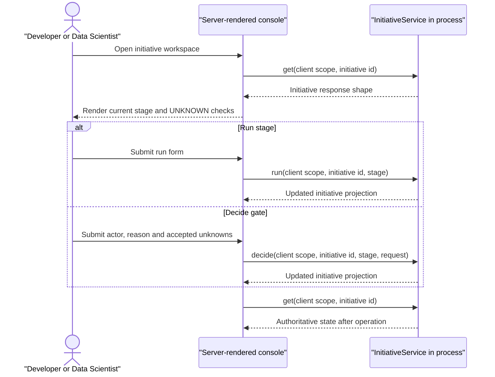

# Layer 0: Model Development Assistant console

**Status: TO BUILD.** No frontend exists today. This specification adds a
server-rendered, read-mostly initiative workspace in the existing `app`
module. It is a view over the Java orchestrator, not a workflow engine. Java
remains the authority for thresholds, human decisions and every state
transition.

Realises [Layer 0 experience](../layer-0-experience.md), part of [the implementation specification index](README.md).

## 1. Scope

Build a single initiative workspace for a Model Developer or Data Scientist:
stage timeline, current draft, deterministic verdicts, attempts, blockers,
unknown checks and gate action. Use server-side rendering with Thymeleaf or an
equivalent Spring MVC view engine; do not add a Node build or SPA. The console
does not hold workflow state, approve work, retry silently, call Python
directly or write a database. Its only state-changing operations are the
existing run and decision POST routes.

## 2. Module and package layout

The existing `app` module has Spring Boot and Spring MVC but currently lacks a
server-side template dependency. Add Thymeleaf to `app/pom.xml` during the
future implementation; this handoff edits no POM.

TO BUILD files:

```text
app/src/main/java/com/aurora/studio/app/console/
  InitiativeWorkspaceController.java
  InitiativeWorkspaceView.java
  ConsoleApiClient.java
  ConsoleError.java
app/src/main/resources/templates/console/
  initiative-workspace.html
  stage-detail.html
  fragments/stage-timeline.html
  fragments/verdict-table.html
  fragments/gate-form.html
  fragments/attempt-list.html
app/src/test/java/com/aurora/studio/app/console/
  InitiativeWorkspaceControllerTest.java
  ConsoleGateFlowTest.java
```

`ConsoleApiClient` is a TO BUILD in-process port despite its route-shaped name.
It calls the existing `InitiativeService` methods directly for the initiative
read and both write operations; it must not issue a loopback HTTP request.
The port preserves the exact request and response shapes of
`GET /api/initiatives/{id}`, `POST /api/initiatives/{id}/stages/{stage}/run`
and `POST /api/initiatives/{id}/stages/{stage}/decision`, so a future
out-of-process console can replace the port without changing the server
contract. The view controller must not depend on Python services or write
workflow state through any other service.

## 3. Types

```java
public record InitiativeWorkspaceView(
    UUID initiativeId,
    String requirementSummary,
    List<StageView> stages,
    StageView currentStage,
    List<String> globalErrors) {}

public record StageView(
    InitiativeStage stage,
    StageStatus status,
    List<AttemptView> attempts,
    List<String> blockers,
    List<FeasibilityCheckView> unknownChecks,
    boolean canRun,
    boolean canDecide) {}

public record AttemptView(
    UUID id,
    int attempt,
    StageStatus status,
    Instant startedAt,
    Instant completedAt,
    DurationSummary duration,
    JsonNode draft,
    List<ValidatorVerdict> verdicts,
    List<String> artifactIds) {}

public record GateForm(
    String decision,
    String actor,
    String reason,
    List<String> acceptedUnknownChecks) {}

public record RunForm(InitiativeStage stage) {}

public interface ConsoleApiClient {
    Initiative get(UUID clientId, UUID initiativeId);
    Initiative run(UUID clientId, UUID initiativeId, InitiativeStage stage);
    Initiative decide(
        UUID clientId,
        UUID initiativeId,
        InitiativeStage stage,
        GateDecisionRequest request);
}
```

`GateForm` maps exactly to the existing `GateDecisionRequest` fields:
`decision`, `actor`, `reason` and `acceptedUnknownChecks`. The console must
render the actual current `GateDecision` and `DurationSummary` values instead
of re-deriving status. `ConsoleApiClient` receives the current client scope
from `ClientContext` and passes it to the existing service/repository path; it
must never fabricate, widen or replace that scope. The browser request carries
the client scope through the existing `ClientScopeFilter`; the in-process call
does not invoke that filter a second time and must preserve the already
validated scope.

## 4. Behaviour

The workspace flow is:

1. `GET /ui/initiatives/{id}` obtains the current client scope established by
   `ClientScopeFilter`, then calls `ConsoleApiClient.get` in-process. It maps
   the same `stages[].attempts[]` response shape as the existing initiative
   route and renders the timeline.
2. Select the latest attempt by the same stage/attempt ordering as Java, then
   display its draft, structured verdicts, blockers, artifact IDs and machine
   versus human-wait duration.
3. Render `UNKNOWN` checks as named unchecked items. For a gated feasibility
   approval, the actor must explicitly select every expected unknown check;
   the form must not silently submit an empty list.
4. Submit a run action with the exact request shape of
   `POST /api/initiatives/{id}/stages/{stage}/run` to
   `ConsoleApiClient.run` in-process. Do not optimistically change the
   timeline; reload the GET projection after the response.
5. Submit a gate action with JSON matching `GateDecisionRequest` to
   `ConsoleApiClient.decide` in-process. Reload only after a successful
   response.
6. Display server error bodies, including 400, 404, 409 and 500, without
   changing local status. A concurrent run is shown as an error and requires
   an explicit reload or user action.

The view may use a small progressive-enhancement script to submit JSON to
those existing routes. It remains server-rendered and has no client-side
workflow store.

### Console read/write flow



## 5. Schema

The console owns no table. It reads `initiatives`,
`initiative_stage_attempts`, `initiative_events`,
`initiative_gate_decisions`, and the related requirement and artifact data
through the existing Java API. It must not introduce a browser-side copy of
workflow state or write directly to PostgreSQL.

## 6. HTTP contract

TO BUILD view routes:

| Route | Method | Purpose |
| --- | --- | --- |
| `/ui/initiatives/{id}` | GET | Whole initiative workspace |
| `/ui/initiatives/{id}/stages/{stage}` | GET | Focused stage detail |

The existing public write routes remain unchanged and are the only write
contracts:

```text
POST /api/initiatives/{id}/stages/{stage}/run
POST /api/initiatives/{id}/stages/{stage}/decision
```

The server-rendered console invokes the corresponding service methods
in-process rather than sending these requests over loopback HTTP. Its port
uses the same request and response shapes as these routes.

Decision JSON example:

```json
{
  "decision": "APPROVE",
  "actor": "named-human-actor",
  "reason": "Reviewed the listed unknown checks",
  "acceptedUnknownChecks": ["history-available"]
}
```

| Condition | Status | Console behaviour |
| --- | ---: | --- |
| Workspace read succeeds | 200 | Render timeline and current state |
| Initiative not found or wrong client | 404 | Render not-found error |
| Invalid stage/run request | 400 | Preserve current view and show error |
| Existing run or duplicate attempt | 409 or mapped API error | Show concurrency error; no local transition |
| Gate missing actor/reason | 400 | Keep form and identify required fields |
| Machine identity submitted | 400 | Refuse and do not reload as approved |
| Unknown checks not exactly accepted | 400 | Show the named expected set |
| Successful run/decision | 200 | Reload the read projection |

## 7. Configuration

| Property | Type | Default | Validation |
| --- | --- | --- | --- |
| `studio.console.enabled` | `boolean` | `false` | explicit enablement |
| `studio.console.template-prefix` | `String` | `console/` | non-blank |

The console does not receive service tokens or client credentials in template
parameters. Actor authentication is not currently supplied by the repository;
until it exists, deployment must place the console behind an authenticated
boundary and the API's existing caller-supplied actor guard must not be
described as authentication.

## 8. Deterministic rules

| Identifier | Rule |
| --- | --- |
| `CONSOLE-READ-PROJECTION` | Rendered status comes from the Java initiative response. |
| `CONSOLE-NO-WORKFLOW-STATE` | Browser memory and templates do not own a stage transition. |
| `CONSOLE-RUN-ROUTE` | Run buttons submit only to the existing run route. |
| `CONSOLE-DECISION-ROUTE` | Gate forms submit only to the existing decision route. |
| `CONSOLE-ACTOR-REQUIRED` | A gate cannot submit without a non-blank actor. |
| `CONSOLE-REASON-REQUIRED` | A gate cannot submit without a non-blank reason. |
| `CONSOLE-NO-MACHINE-APPROVAL` | Machine identities are refused by the existing Java guard. |
| `CONSOLE-UNKNOWN-EXPLICIT` | `acceptedUnknownChecks` is shown and selected explicitly. |
| `CONSOLE-NO-SILENT-RETRY` | Errors never trigger an automatic run or decision. |

## 9. Failure and refusal matrix

| Condition | Outcome | Persisted record | Console behaviour |
| --- | --- | --- | --- |
| Read API unavailable | read failure | none | Render bounded unavailable state |
| Run API rejects predecessor | refusal | Java existing event/attempt | Show predecessor message |
| Concurrent run | conflict | Java existing conflict path | No optimistic state change |
| Blank actor/reason | refusal | no gate decision | Client validation plus server error |
| Machine actor | refusal | no gate decision | Show no-self-approval error |
| Partial unknown acceptance | refusal | no transition | Show exact expected unknown list |
| Successful approval | Java gate decision | append-only decision/event | Reload; do not claim execution |

## 10. Tests to write

Spring MVC unit tests:

- `workspaceRendersStageTimelineFromInitiativeResponse`.
- `workspaceRendersAttemptsVerdictsAndDurations`.
- `workspaceShowsUnknownChecksExplicitly`.
- `workspaceMapsRunFormToExistingRunContract`.
- `workspaceMapsGateFormToExistingDecisionContract`.
- `consoleUsesInProcessInitiativeServiceWithoutLoopbackHttp`.
- `consolePropagatesCurrentClientScopeWithoutWideningIt`.
- `consoleCannotApproveWithoutActorAndReason`.
- `consoleCannotSubmitMachineIdentityAsApproval`.
- `consoleDoesNotChangeLocalStateAfterApiFailure`.

`@SpringBootTest` tests:

- `consoleTemplatesLoadWhenEnabled`.
- `consoleDisabledByDefault`.
- `consoleReloadsProjectionAfterSuccessfulDecision`.
- `consoleDoesNotDependOnPythonServices`.

The tests should use MockMvc and a mocked `ConsoleApiClient`, following the
existing Spring MVC tests' request and JSON assertions. A contract test must
assert the serialized decision field names match `GateDecisionRequest`.

## 11. Acceptance criteria

- [ ] The UI is server-rendered and requires no Node build or SPA state store.
- [ ] Every displayed status, attempt and verdict comes from the Java read
      projection.
- [ ] The only writes are the two existing POST routes.
- [ ] Actor, reason and `acceptedUnknownChecks` are explicit in the gate form.
- [ ] No self-approval or client-side optimistic approval is possible.
- [ ] API failures and concurrent runs leave the displayed workflow unchanged.
- [ ] No console code calls Python or writes a database.

## 12. Open decisions

- **Template engine:** recommendation: Thymeleaf because the application is
  Spring MVC and has no existing frontend build; add the missing dependency.
- **Actor authentication:** recommendation: integrate deployment identity and
  map it to the API actor before enabling the console in production.
- **Future extraction:** recommendation: retain the route-shaped
  `ConsoleApiClient` port so an out-of-process console can replace the
  in-process implementation without changing the two existing API contracts.
