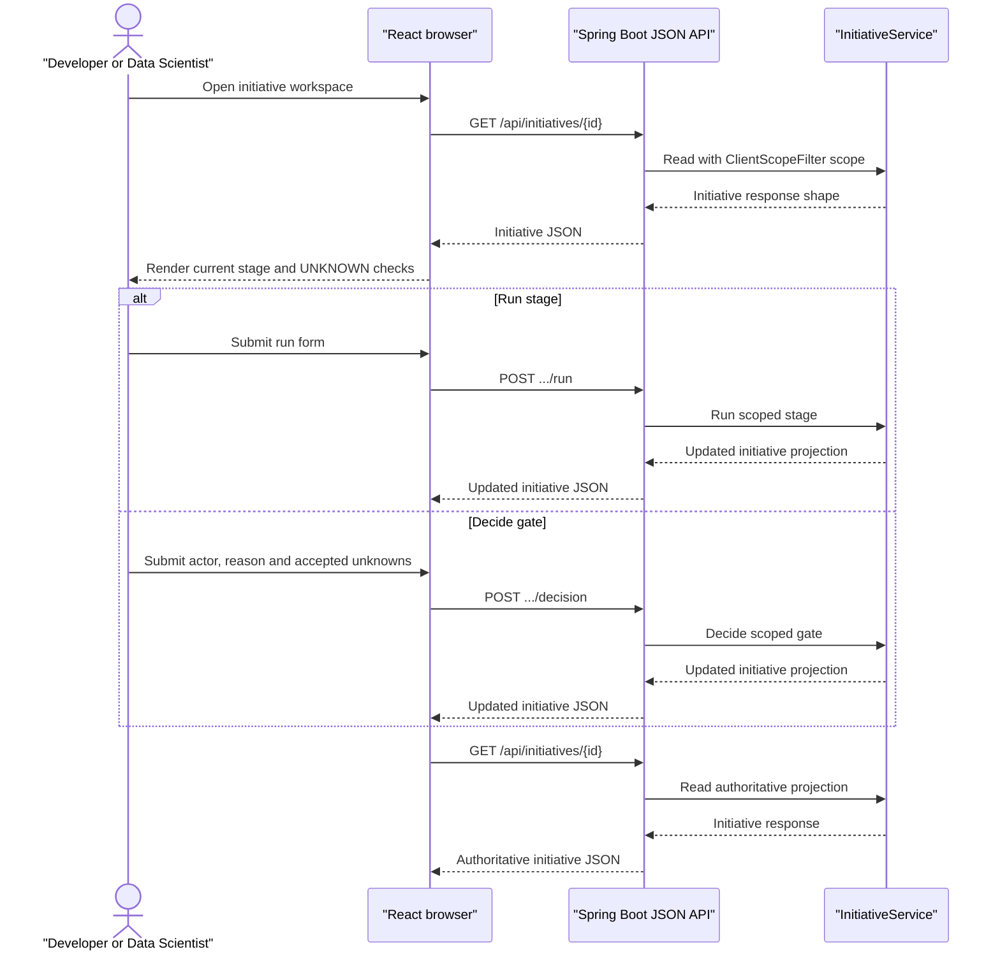

# Layer 0: Model Development Assistant console

**Status: TO BUILD.** No frontend exists today. This specification adds a
React and TypeScript single-page application in a new top-level `frontend/`
project. It is a read-mostly workspace over the Java JSON API, not a workflow
engine. Java remains the authority for thresholds, human decisions and every
state transition.

Realises [Layer 0 experience](../layer-0-experience.md), part of [the implementation specification index](README.md).

## 1. Scope

Build a single initiative workspace for a Model Developer or Data Scientist:
stage timeline, current draft, deterministic verdicts, attempts, blockers,
unknown checks and gate action. Use React 18, TypeScript and Vite in a new
`frontend/` project outside the Maven reactor. The console does not hold
workflow state, approve work, retry silently, call Python directly or write a
database. Its only state-changing operations are the existing run and decision
POST routes.

The console needs no new backend route and no new server contract.
`GET /api/initiatives`, `GET /api/initiatives/{id}`,
`POST /api/initiatives/{id}/stages/{stage}/run` and
`POST /api/initiatives/{id}/stages/{stage}/decision` already return and accept
everything the workspace needs. Spring Boot serves JSON only and stops
rendering HTML for this surface.

## 2. Module and package layout

Create this TO BUILD project outside the Maven reactor:

```text
frontend/
  package.json
  tsconfig.json
  vite.config.ts
  index.html
  src/
    main.tsx
    App.tsx
    api/initiativeApi.ts
    api/clientScope.ts
    types/initiative.ts
    components/StageTimeline.tsx
    components/StageDetail.tsx
    components/VerdictTable.tsx
    components/UnknownCheckList.tsx
    components/GateForm.tsx
    components/RunForm.tsx
    components/AttemptList.tsx
    components/ErrorPanel.tsx
    tests/StageTimeline.test.tsx
    tests/VerdictTable.test.tsx
    tests/UnknownCheckList.test.tsx
    tests/GateForm.test.tsx
    tests/initiativeApi.test.ts
  e2e/
    initiative-run.spec.ts
    initiative-gate.spec.ts
```

Use React 18, TypeScript, Vite, Vitest, React Testing Library and Playwright.
Exact dependency versions are selected at implementation time and must be
releases at least seven days old. Vite is the selected tool because this is an
internal, authenticated, read-mostly workspace with no SSR or SEO requirement.

## 3. Types

```ts
export interface Initiative {
  id: string;
  requirementId: string;
  requirementSummary: string;
  stages: StageView[];
  currentStage: StageView | null;
  globalErrors: string[];
}

export interface StageView {
  stage: string;
  status: string;
  attempts: AttemptView[];
  blockers: string[];
  unknownChecks: FeasibilityCheckView[];
  canRun: boolean;
  canDecide: boolean;
}

export interface AttemptView {
  id: string;
  attempt: number;
  status: string;
  startedAt: string;
  completedAt: string | null;
  duration: DurationSummary | null;
  draft: unknown | null;
  verdicts: ValidatorVerdict[];
  artifactIds: string[];
}

export interface GateForm {
  decision: string;
  actor: string;
  reason: string;
  acceptedUnknownChecks: string[];
}

export interface RunForm {
  stage: string;
}
```

These interfaces are TO BUILD client types derived from the existing JSON
response shape; the implementation must verify each field against the
controller's serialized `Initiative`, `StageView`, `AttemptView`,
`FeasibilityCheckView`, `DurationSummary` and `ValidatorVerdict` fields rather
than inventing a second response contract. `GateForm` maps field-for-field
onto the existing `GateDecisionRequest`: `decision`, `actor`, `reason` and
`acceptedUnknownChecks`. The browser request passes through the existing
`ClientScopeFilter` exactly once. The SPA must not hold or send an invented
client id, widen scope, or hold a service token.

## 4. Behaviour

The workspace flow is:

1. Fetch `GET /api/initiatives/{id}` with the browser's existing authenticated
   session and client scope. The API request passes through
   `ClientScopeFilter` exactly once and returns the `stages[].attempts[]`
   projection used by the timeline.
2. Select the latest attempt by the same stage/attempt ordering as Java, then
   display its draft, structured verdicts, blockers, artifact IDs and machine
   versus human-wait duration.
3. Render `UNKNOWN` checks as named unchecked items. For a gated feasibility
   approval, the actor must explicitly select every expected unknown check;
   the form must not silently submit an empty list.
4. Submit a run action with the exact request shape of
   `POST /api/initiatives/{id}/stages/{stage}/run`. Do not optimistically
   change the timeline; fetch the GET projection again after a successful
   response.
5. Submit a gate action with JSON matching `GateDecisionRequest` to
   `POST /api/initiatives/{id}/stages/{stage}/decision`. Fetch the projection
   again only after a successful response.
6. Display server error bodies, including 400, 404, 409 and 500, without
   changing local status. A concurrent run is shown as an error and requires
   an explicit reload or user action.

The SPA uses its typed API client to submit JSON to those existing routes. It
renders a server projection and has no client-side workflow store.

### Console read/write flow



## 5. Schema

The console owns no table. It reads `initiatives`,
`initiative_stage_attempts`, `initiative_events`,
`initiative_gate_decisions`, and the related requirement and artifact data
through the existing Java API. It must not introduce a browser-side copy of
workflow state or write directly to PostgreSQL.

## 6. HTTP contract

There is no new backend route or server contract. The React SPA uses these
existing JSON API routes:

```text
GET /api/initiatives
GET /api/initiatives/{id}
POST /api/initiatives/{id}/stages/{stage}/run
POST /api/initiatives/{id}/stages/{stage}/decision
```

Spring Boot serves JSON for these routes and does not render HTML for the
console. These two POST routes are the only write paths available to the
workspace.

Decision JSON example:

```json
{
  "decision": "APPROVE",
  "actor": "named-human-actor",
  "reason": "Reviewed the listed unknown checks",
  "acceptedUnknownChecks": ["history-available"]
}
```

| Condition | Status | Console behaviour |
| --- | ---: | --- |
| Workspace read succeeds | 200 | Render timeline and current state |
| Initiative not found or wrong client | 404 | Render not-found error |
| Invalid stage/run request | 400 | Preserve current view and show error |
| Existing run or duplicate attempt | 409 or mapped API error | Show concurrency error; no local transition |
| Gate missing actor/reason | 400 | Keep form and identify required fields |
| Machine identity submitted | 400 | Refuse and do not reload as approved |
| Unknown checks not exactly accepted | 400 | Show the named expected set |
| Successful run/decision | 200 | Reload the read projection |

## 7. Configuration

| Property | Type | Default | Validation |
| --- | --- | --- | --- |
| `studio.console.enabled` | `boolean` | `false` | explicit enablement |
| `studio.console.dev-origin` | `URI` | unset | development only; must be an explicit non-wildcard origin |

Production serves the built static assets from the same origin as the API,
either from `app` static resources or a static host in front of the same
gateway, so no CORS relaxation is needed. The Vite development server proxies
`/api` to `http://localhost:8081`; `studio.console.dev-origin` permits only
that explicitly configured development origin. A wildcard CORS origin is
refused. The SPA never holds a service token or invented client id.

Actor authentication is not currently supplied by the repository; until it
exists, deployment must place the console behind an authenticated boundary.
The API's caller-supplied actor guard is not authentication.

## 8. Deterministic rules

| Identifier | Rule |
| --- | --- |
| `CONSOLE-READ-PROJECTION` | Rendered status comes from the Java initiative response. |
| `CONSOLE-NO-WORKFLOW-STATE` | Browser memory and React components do not own a stage transition. |
| `CONSOLE-RUN-ROUTE` | Run buttons submit only to the existing run route. |
| `CONSOLE-DECISION-ROUTE` | Gate forms submit only to the existing decision route. |
| `CONSOLE-ACTOR-REQUIRED` | A gate cannot submit without a non-blank actor. |
| `CONSOLE-REASON-REQUIRED` | A gate cannot submit without a non-blank reason. |
| `CONSOLE-NO-MACHINE-APPROVAL` | Machine identities are refused by the existing Java guard. |
| `CONSOLE-UNKNOWN-EXPLICIT` | `acceptedUnknownChecks` is shown and selected explicitly. |
| `CONSOLE-NO-SILENT-RETRY` | Errors never trigger an automatic run or decision. |
| `CONSOLE-NO-INVENTED-SCOPE` | The SPA never supplies or widens client scope. |
| `CONSOLE-NO-BROWSER-TOKEN` | No service token is held or sent by browser code. |
| `CONSOLE-NO-CLIENT-VERDICTS` | Thresholds and verdicts are never computed in the browser. |
| `CONSOLE-REFETCH-AFTER-WRITE` | A successful run or decision re-fetches the server projection. |

## 9. Failure and refusal matrix

| Condition | Outcome | Persisted record | Console behaviour |
| --- | --- | --- | --- |
| Read API unavailable | read failure | none | Render bounded unavailable state |
| Run API rejects predecessor | refusal | Java existing event/attempt | Show predecessor message |
| Concurrent run | conflict | Java existing conflict path | No optimistic state change |
| Blank actor/reason | refusal | no gate decision | Client validation plus server error |
| Machine actor | refusal | no gate decision | Show no-self-approval error |
| Partial unknown acceptance | refusal | no transition | Show exact expected unknown list |
| Successful approval | Java gate decision | append-only decision/event | Reload; do not claim execution |

## 10. Tests to write

Component and unit tests use Vitest and React Testing Library:

- `StageTimelineRendersServerStatusesAndAttempts`.
- `VerdictTableRendersStructuredRulesWithoutRecomputingThem`.
- `UnknownCheckListRequiresEveryExpectedAcceptance`.
- `GateFormRejectsBlankActorAndReason`.
- `GateFormRejectsMachineIdentity`.
- `InitiativeApiPreservesServerStateAfter400404409And500`.
- `InitiativeApiRefetchesAfterSuccessfulRunOrDecision`.
- `InitiativeApiNeverSendsAServiceTokenOrInventedClientId`.
- `ViteProxyAllowsConfiguredDevOriginAndRejectsWildcard`.

End-to-end tests use Playwright, which the companion runtime repository already
uses:

- `runFlowCallsExistingRunRouteAndRendersReturnedProjection`.
- `gateFlowCallsExistingDecisionRouteWithAcceptedUnknownChecks`.
- `gateFlowCannotSubmitWithoutActorAndReason`.
- `gateFlowRefusesPartialUnknownAcceptance`.
- `failedApiWriteLeavesDisplayedProjectionUntouched`.

Tests run against a running API and assert that the browser makes no direct
Python or database connection. Server-side console tests are not part of this
frontend specification.

## 11. Acceptance criteria

- [ ] The UI is a React 18 and TypeScript SPA built by Vite in `frontend/`,
      outside the Maven reactor.
- [ ] Every displayed status, attempt and verdict comes from the Java read
      projection.
- [ ] The only writes are the two existing POST routes.
- [ ] Actor, reason and `acceptedUnknownChecks` are explicit in the gate form.
- [ ] No self-approval or client-side optimistic approval is possible.
- [ ] API failures and concurrent runs leave the displayed workflow unchanged.
- [ ] No console code calls Python, writes a database, holds a service token,
      or invents client scope.
- [ ] Successful writes re-fetch the server projection.

## 12. Open decisions

- **Frontend toolchain:** recommendation: use Vite as specified. Next.js,
  already used by the companion runtime repository, is the alternative if the
  client wants one frontend toolchain across both repositories.
- **Actor authentication:** recommendation: integrate deployment identity and
  map it to the API actor before enabling the console in production.
- **Static asset hosting:** decide whether `app` static resources or a static
  host in front of the same gateway serves the production build; either keeps
  the browser and API same-origin.
