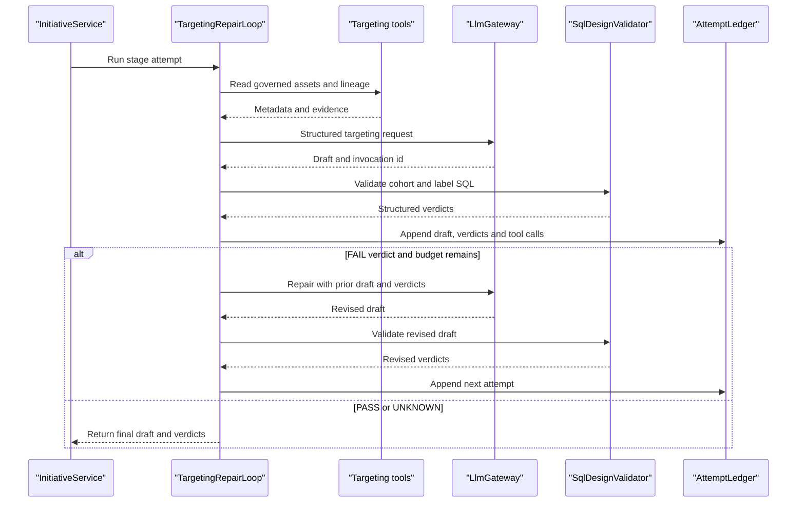

# Layer 2 Targeting Repair Agent

**Status: TO BUILD.** The current targeting path is a one-shot
`InitiativeService.finishTargeting` call. This specification turns it into a
bounded repair loop while retaining the existing deterministic SQL judge.

## 1. Scope

Build a Targeting Repair Agent that reads governed data-asset and lineage
evidence, requests a structured targeting draft, calls `SqlDesignValidator`,
and repairs rejected drafts within the agent-platform budget. It does not
execute SQL, access client rows, alter validator thresholds, approve a gate,
or change initiative stage status directly.

## 2. Module and package layout

The existing Maven module is `initiative`; add the `agentplatform` dependency
described in [the runtime specification](agent-platform-runtime.md). Create
these new files under
`initiative/src/main/java/com/aurora/studio/initiative/targeting/`:

```text
TargetingDraft.java
TargetingJudge.java
TargetingRepairLoop.java
GovernedReferenceLookupTool.java
SqlDesignValidationTool.java
TargetingLoopDefinition.java
```

`SqlDesignValidator` remains the existing package-private class in
`com.aurora.studio.initiative`; `SqlDesignValidationTool` is in that package
or receives a new public facade in the same module. No validator logic moves
to `agentplatform`.

## 3. Types

```java
public record TargetingDraft(
    String cohortSql,
    String labelSql,
    String asOfSemantics,
    List<EvidenceCitation> citations) {}

public record TargetingVerdict(
    String ruleId,
    String status,
    String reason,
    List<EvidenceCitation> citations) {}

public record TargetingValidationInput(
    TargetingDraft draft,
    ModelRequirement requirement,
    List<KnowledgeObject> assets,
    List<KnowledgeObject> lineageObjects,
    List<KnowledgeRelationship> relationships) {}

public interface TargetingJudge {
  List<TargetingVerdict> judge(TargetingValidationInput input);
}

public interface TargetingRepairLoop {
  LoopOutcome<TargetingDraft, TargetingVerdict> run(
      UUID initiativeId, UUID stageAttemptId, ModelRequirement requirement);
}

public record GovernedReferenceLookupInput(
    String objectType, String name, boolean includeCandidates) {}

public record GovernedReference(
    UUID objectId,
    String knowledgeKey,
    String name,
    Map<String, Object> attributes,
    List<KnowledgeEvidence> evidence) {}
```

`SqlDesignValidationTool` returns structured `TargetingVerdict` records, not
the existing prose `ValidatorVerdict` alone. Its adapter maps the existing
rule names unchanged: `parseable-single-read-only`, `explicit-projection`,
`governed-references`, `output-contract`, `point-in-time-safety`,
`target-leakage` and `label-horizon-agreement`.

## 4. Behaviour

`TargetingRepairLoop.run`:

1. Load the requirement through `DiscoveryService.getRequirement` and governed
   assets through `KnowledgeService.search`; load lineage exactly as the
   current `lineageContext` method does.
2. Register two tools for this capability:
   `GovernedReferenceLookupTool` and `SqlDesignValidationTool`. The first
   returns only client-scoped governed metadata and evidence; it never returns
   client rows. The second calls `SqlDesignValidator.validateCohort` and,
   when a label exists and observables are declared,
   `validateLabel`.
3. Create the first `LlmRequest` with task id
   `targeting-repair-{stageAttemptId}-1`, template id
   `targeting-repair`, version `1`, schema id `targeting-repair-v1`, output
   limit `1200`, timeout `Duration.ofSeconds(10)`, and the existing
   `RedactionPolicy.extractionDefault()`.
4. Include requirement, governed asset metadata, lineage references, target
   observable, citation ids and structured tool output. Do not include
   unbounded prose verdicts as the repair instruction.
5. Decode `drafts[]` into `TargetingDraft` records. Judge every draft and
   choose no winner until the deterministic verdicts are available.
6. Persist the attempt, its tool calls, invocation id, draft and verdicts.
   For `FAIL`, build the next prompt from the previous draft plus a sorted
   array of `{ruleId,status,reason}` verdicts. For `UNKNOWN`, preserve the
   citation gap and stop at the human gate; do not ask the model to guess.
7. On a passing draft, return `ACCEPTED`; on only unknown rules, return
   `HUMAN_GATE_REQUIRED`; after the budget, return the last draft and
   unresolved verdicts. The caller then persists the final stage result.

Each attempt is committed after judging and before the next gateway call.
The provider call is not inside the transaction. A provider refusal or failure
gets an empty draft attempt linked to its `llm_invocations` row.

### Change to `InitiativeService.finishTargeting`

Current signature, retained exactly:

```java
private Initiative finishTargeting(
    InitiativeRepository.Base base,
    InitiativeRepository.Attempt attempt,
    Instant started)
```

Pseudo-diff:

```diff
 private Initiative finishTargeting(Base base, Attempt attempt, Instant started) {
-  LlmResult result = gateway.complete(new LlmRequest(... "targeting-design", ...));
-  if (!result.successful()) return finishProviderFailure(...);
-  for (Map<String,Object> draft : drafts(result.payload())) {
-    verdicts.addAll(SqlDesignValidator.validateCohort(...));
-  }
-  return finishGeneratedStage(...);
+  LoopOutcome<TargetingDraft, TargetingVerdict> outcome =
+      targetingRepairLoop.run(base.id(), attempt.id(),
+          discovery.getRequirement(base.requirementId()));
+  List<GenerationDraft> persisted =
+      outcomeToGenerationDrafts(outcome, attempt.id());
+  StageStatus status = switch (outcome.termination()) {
+    case ACCEPTED -> StageStatus.COMPLETED;
+    case HUMAN_GATE_REQUIRED, BUDGET_EXHAUSTED -> StageStatus.AWAITING_APPROVAL;
+    case PROVIDER_REFUSED, PROVIDER_FAILED -> StageStatus.PROVIDER_FAILED;
+    default -> StageStatus.BLOCKED;
+  };
+  saveFinalTargetingAttempt(attempt, started, persisted, outcome, status);
+  return get(base.id());
 }
```

The helper must preserve the existing `generation_drafts`,
`drafts_generated`, `drafts_rejected`, `violated_checks`, `artifact_ids` and
`initiative_events` writes. It must not call `decide`, `insertGateDecision`
or update an initiative row.

## 5. Schema

No new targeting-specific migration is allocated. V15/V16 store all targeting
attempts and tool calls. Existing `initiative_stage_attempts` remains the
stage-level summary and is updated only by `InitiativeRepository` after the
loop returns. Every attempt references `capability_loop_state`, which
references the client-scoped `initiative_stage_attempts` row.

## 6. HTTP contract

The existing route remains the public entry point:

```text
POST /api/initiatives/{id}/stages/TARGETING_DESIGN/run
```

Request body: none. Response: the existing `Initiative` record, including the
updated stage attempt. Proposed loop diagnostics are internal and appear in
the attempt ledger; do not expose provider prompts.

| Condition | Status | Body |
| --- | --- | --- |
| Valid run | 200 | Existing `Initiative` JSON |
| Unknown initiative | 404 | `{"error":"Initiative was not found"}` |
| Predecessor incomplete | 400 | Existing `IllegalStateException` error |
| Already running | 400 or 409 | Existing state/race mapping |
| Provider failure | 200 | Stage status `PROVIDER_FAILED` |
| Exhausted repairs | 200 | Stage status `AWAITING_APPROVAL` with verdicts |
| Validator blocker | 200 | Stage status `BLOCKED` with named checks |

### Repair-loop sequence



## 7. Configuration

Use `aurora.agent.max-attempts=3`,
`aurora.agent.max-tool-calls=12`, `aurora.agent.attempt-timeout=PT30S`,
`aurora.agent.tool-timeout=PT10S` and `aurora.agent.loop-timeout=PT2M`.
The targeting definition may lower the budget for a stage but may not raise the
configured maximum.

## 8. Deterministic rules

| Identifier | Rule |
| --- | --- |
| `TARGETING-SINGLE-SELECT` | Exactly one parseable `SELECT` statement is allowed. |
| `TARGETING-NO-SELECT-STAR` | Wildcard projection is refused. |
| `TARGETING-GOVERNED-REFERENCES` | Every table and column must exist in governed metadata. |
| `TARGETING-REQUIRED-PROJECTIONS` | Cohort includes exactly one governed entity and as-of projection. |
| `TARGETING-POINT-IN-TIME` | The event-time predicate is bounded by `:as_of` and is not forward-looking. |
| `TARGETING-NO-LEAKAGE` | Direct or governed-derived target references fail. |
| `TARGETING-HORIZON-AGREEMENT` | Label interval agrees with the requirement horizon when comparable. |
| `TARGETING-CITED-EVIDENCE` | Asset and lineage claims used to pass a rule carry valid evidence citations. |

These are the existing validator behaviours; the stable identifiers are the
contract used in persisted structured verdicts. The loop cannot alter their
logic or thresholds.

## 9. Failure and refusal matrix

| Condition | Outcome | Persisted record | HTTP status |
| --- | --- | --- | --- |
| Blank or multi-statement SQL | `REJECTED` | Attempt and `parseable-single-read-only` verdict | 200 |
| Unknown table/column | `REJECTED` | Attempt and `governed-references` verdict | 200 |
| Missing metadata | `UNKNOWN` | Attempt and citation/metadata verdict | 200 |
| Forward-looking or unbounded time | `REJECTED` | Attempt and `point-in-time-safety` verdict | 200 |
| Target leakage | `REJECTED` | Attempt and `target-leakage` verdict | 200 |
| Uncited governed claim | `HUMAN_GATE_REQUIRED` | Attempt with citation failure | 200 |
| Provider refusal/schema failure | `PROVIDER_FAILED` | `llm_invocations` and attempt | 200 |
| All drafts rejected after budget | `AWAITING_APPROVAL` or `BLOCKED` | All attempts plus stage summary | 200 |

## 10. Tests to write

Unit tests:

- `TargetingJudgeMapsSqlValidatorRuleNames`: assert every validator verdict
  maps to its stable rule id.
- `RepairPromptContainsPreviousDraftAndStructuredVerdicts`: assert no prose
  summary replaces the typed verdict array.
- `TargetingLoopStopsOnUnknownCitation`: assert no second provider call.
- `TargetingLoopPersistsRejectedAttemptBeforeRepair`.
- `TargetingLoopReturnsLastDraftWhenBudgetExhausted`.
- `TargetingToolsNeverReturnClientRows`.

`InitiativeServiceTest` additions:

- `targetingRepairUsesGatewayOncePerApplicationAttempt`.
- `rejectedTargetingAttemptIsKeptAndSecondDraftIsRequested`.
- `targetingUnknownMapsToAwaitingApprovalWithoutMachineDecision`.
- `targetingProviderFailureKeepsInvocationAndSetsProviderFailed`.
- `targetingLoopDoesNotWriteStageStatusBeforeServiceSummary`.

Repository/Testcontainers tests:

- `targetingAttemptsHaveClientCompositeLinks`.
- `targetingAgentAttemptAndToolRowsAreAppendOnly`.
- `targetingLoopCannotReuseAnotherInitiativeStageAttempt`.

These extend the existing `InitiativeServiceTest`,
`InitiativeRepositoryTest`, `SqlDesignValidatorTest` and
`GatewayServiceTest` conventions.

## 11. Acceptance criteria

- [ ] Existing route and `finishTargeting` signature remain unchanged.
- [ ] Every attempted draft and verdict is persisted before repair.
- [ ] Repair prompts contain structured verdicts and the previous draft.
- [ ] `SqlDesignValidator` remains the only authority for SQL verdicts.
- [ ] No client rows are touched by Layer 2.
- [ ] Provider retries remain visible through `llm_invocations.retry_count`.
- [ ] The loop never approves or changes stage status directly.
- [ ] All named tests pass and append-only triggers are exercised.

## 12. Open decisions

- Whether a rejected draft should be returned as `BLOCKED` immediately or
  remain `AWAITING_APPROVAL` after budget exhaustion. Recommendation:
  `BLOCKED` when every final verdict is `FAIL`; `AWAITING_APPROVAL` only when
  at least one unresolved `UNKNOWN` remains.
- Whether to expose attempt diagnostics in the initiative response.
  Recommendation: expose structured verdicts and counts, never prompts.
