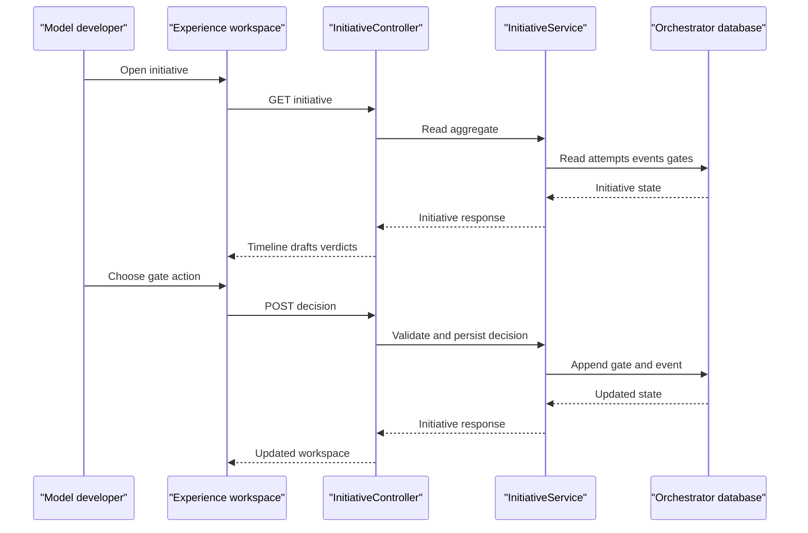

# Layer 0: Experience

_Conversational, not a form._

## 1. Purpose

The Experience layer will give a model developer or data scientist one
business-facing Model Development Assistant workspace. It interprets the
requirement in business language, names what it does not know, and asks rather
than assumes. It is responsible for showing initiative progress, the current
draft, deterministic verdicts and the human gate action; it is not responsible
for workflow state, validation, approvals or client data execution.

## 2. Status

**TO BUILD.** There is no console or frontend module. Current interaction is
HTTP plus the `ImporterCommand` CLI, so the design below is a proposed view over
the existing orchestrator.

## 3. Components

| component | responsibility | implementing class/table | notes |
| --- | --- | --- | --- |
| Initiative workspace | Show timeline, current attempt, drafts, verdicts, blockers and gates | TO BUILD | Must hold no workflow state of its own |
| Stage timeline | Render all `InitiativeStage` values and `StageStatus` values | TO BUILD | Reads the aggregate returned by `InitiativeController` |
| Gate panel | Submit a named decision and reason | TO BUILD | Must use the existing decision route |
| Operational CLI | Import, extract, seed and backfill operations | `ImporterCommand` | Not a business-facing console |
| API view | Supply the whole initiative aggregate | `InitiativeController` and `GET /api/initiatives/{id}` | No dedicated whole-initiative read model exists |

## 4. Interfaces

Current read and write routes:

```text
GET  /api/initiatives/{id}
POST /api/initiatives/{id}/stages/{stage}/run
POST /api/initiatives/{id}/stages/{stage}/decision
```

The workspace should call the existing routes rather than write state:

```json
{
  "decision": "APPROVE",
  "actor": "named-human",
  "reason": "Reviewed the displayed evidence",
  "acceptedUnknownChecks": []
}
```

The response is the `Initiative` record: `id`, `requirementId`, `requirement`,
`status`, `stages`, `artifacts`, `blockers`, `gateDecisions`, `durations` and
`events`, including `actorIdentityVerified`. A future read model may reshape
this for the workspace but must remain derived from the orchestrator.

Every request also needs `X-Aurora-Client`. The current actor is a caller-
supplied string. `InitiativeActors.MACHINE_IDENTITIES` contains only
`initiative-orchestrator`; the exact-set check prevents that known orchestrator
identity from approving a gate it created. It does not authenticate the caller.

## 5. Data model

The Experience layer owns no tables. The proposed read model is disposable and
derived:

```sql
create table initiative_workspace_projection (
  client_id uuid not null,
  initiative_id uuid not null,
  payload jsonb not null,
  refreshed_at timestamptz not null,
  primary key (client_id, initiative_id)
);
```

This is a design sketch only. The existing source of truth remains
`initiatives`, `initiative_stage_attempts`, `initiative_events`,
`initiative_gate_decisions` and the related handoff records. A projection must
retain `client_id` in every key and must never accept writes from the browser.

## 6. Main path



## 7. Deterministic vs agent split

The workspace may help a user find evidence, explain a verdict or prepare a
decision. It may not choose a stage, alter a draft, approve a gate or write
workflow state. The orchestrator remains the system of record so the displayed
state and the persisted state cannot diverge.

## 8. Failure and refusal behaviour

The workspace must display, not reinterpret, these outcomes:

- missing or unknown `X-Aurora-Client`: HTTP 400 from `ClientScopeFilter`;
- missing initiative or stage: HTTP 404;
- invalid gate input: HTTP 400 with an `error` field;
- stage already running: HTTP 409 for `StageAlreadyRunningException`;
- non-predecessor or non-runnable stage: HTTP 400;
- provider failure, blocker or unknown verdict: the returned `StageStatus`;
- caller identity: `actorIdentityVerified` remains false.

Concurrent state changes must be retried by reading the aggregate again, never
resolved by client-side state mutation.

## 9. Tech stack

The proposed console is React 18 and TypeScript with Vite in a separate
frontend project. Spring Boot remains a JSON API over Java 21 and
JDBC-backed records; the browser calls the existing API and must not duplicate
the workflow state machine.

## 10. Open questions / risks

- Which authenticated identity provider will replace caller-asserted actors?
- Should the read model be a SQL view, a projection table, or an API assembler?
- Large initiative histories may need pagination without changing append-only
  records.

## 11. Implementation specifications

| Component | Implementation specification | What the specification adds |
| --- | --- | --- |
| Initiative workspace | [Layer 0 console](impl/layer-0-console.md) | React SPA, typed JSON contracts, scope propagation and refusal behaviour |

The conversational assistant interaction has no implementation specification
yet. The console spec covers the React workspace, while the assistant
interaction remains a future experience decision.
