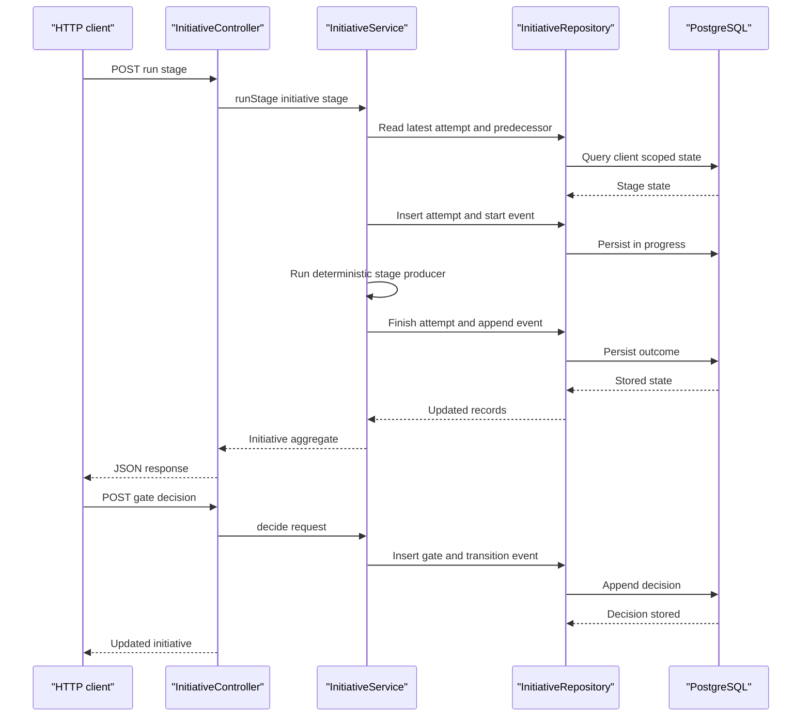

# Layer 1: Governed orchestration

_System of record._

## 1. Purpose

The Governed Orchestration layer owns initiative state, stage order, attempts,
human gates, events and duration accounting. Its deterministic orchestrator is
deliberately never an agent. The layer is not an autonomous planner, an
execution engine, or an authenticated identity provider.

## 2. Status

**BUILT; guided autonomy and telemetry are PARTIAL.** `InitiativeService` and
`InitiativeController` implement the state machine, while advisor autonomy and
a standalone telemetry subsystem do not exist.

## 3. Components

| component | responsibility | implementing class/table | notes |
| --- | --- | --- | --- |
| Initiative API | Create, list, read and operate initiatives | `InitiativeController` | All routes are HTTP |
| Deterministic Orchestrator | Dispatch runnable stages and enforce predecessors | `InitiativeService.runStage`, `InitiativeStage`, `ClientScopeFilter` | Built and deliberately never an agent; request scoping and the self-approval guard are not authenticated authorisation; `CANDIDATE_BUILD` is skipped as `OUT_OF_SCOPE` |
| Stage attempts | Persist status, blockers, checks, drafts and artifacts | `initiative_stage_attempts`, `StageAttempt` | Unique `(client_id, initiative_id, stage, attempt)` |
| Human gates | Validate and append decisions | `InitiativeService.decide`, `initiative_gate_decisions` | Verbs are `APPROVE`, `REJECT`, `RETURN` |
| Events | Record status transitions and actor/reason | `initiative_events`, `InitiativeEvent` | Database trigger makes records append-only |
| Duration accounting | Separate machine work and human waiting | `DurationSummary` | Optional client baseline is caller-declared |
| Guided autonomy | Stop at bounded producers and gates | `InitiativeService` | Partial; no advisor agent exists |
| Telemetry | Expose timing and event history | `DurationSummary`, `initiative_events` | Partial; not a telemetry system |
| Advisor Agent | Read state, diagnose a blocked stage and recommend recovery | TO BUILD | Read-only; cannot write state or choose the next stage |

The stages are ordered in the enum as:

```text
REQUIREMENT_INTAKE
KNOWLEDGE_DISCOVERY
REUSE_DECISION
DATA_FEASIBILITY
TARGETING_DESIGN
FEATURE_DESIGN
CANDIDATE_BUILD
EXPERIMENT_DESIGN
HANDOFF
```

`StageStatus` values are `PENDING`, `IN_PROGRESS`, `AWAITING_APPROVAL`,
`COMPLETED`, `BLOCKED`, `PROVIDER_FAILED`, `REJECTED`, `NOT_IMPLEMENTED` and
`OUT_OF_SCOPE`.

At creation, requirement intake is `COMPLETED`, candidate build is
`OUT_OF_SCOPE`, and the remaining stages are `PENDING`; the repository's
`notImplemented` hook currently returns `false`.

## 4. Interfaces

`InitiativeController` exposes:

```text
POST /api/initiatives
GET  /api/initiatives
GET  /api/initiatives/{id}
POST /api/initiatives/{id}/stages/{stage}/run
POST /api/initiatives/{id}/stages/{stage}/decision
```

Create request:

```json
{
  "requirementId": "uuid",
  "includeCandidates": false,
  "clientBaselineDurationMillis": null
}
```

Gate request:

```json
{
  "decision": "APPROVE",
  "actor": "named-human",
  "reason": "Evidence reviewed",
  "acceptedUnknownChecks": ["data-asset-resolution"]
}
```

The response is the assembled `Initiative`. `runStage` enforces the predecessor
status. `decide` requires a gated stage, a non-blank actor and reason, one of
the three verbs, and the exact set of unknown checks when approving relevant
unknown feasibility.

## 5. Data model

`V6__initiatives_and_orchestration.sql` owns:

| table | important columns and invariants |
| --- | --- |
| `initiatives` | `id`, `client_id`, `requirement_id`, `include_candidates`, `client_baseline_duration_millis`, `created_at`; composite foreign key to `discovery_requirements` |
| `initiative_stage_attempts` | `id`, `client_id`, `initiative_id`, `stage`, `attempt`, `status`, timestamps, machine and human-wait durations, JSONB blockers/checks/artifacts; unique client-scoped initiative/stage/attempt |
| `initiative_events` | `id`, `client_id`, `initiative_id`, `stage`, `from_status`, `to_status`, `actor`, `reason`, `artifact_ids`, `at`; update and delete rejected |
| `initiative_gate_decisions` | `id`, `client_id`, `initiative_id`, `stage_attempt_id`, `stage`, `decision`, `actor`, `actor_verified`, `reason`, `accepted_unknown_checks`, `created_at`; decision check constraint and append-only trigger |

`V7__mark_client_training_out_of_scope.sql` marks existing
`CANDIDATE_BUILD` attempts `OUT_OF_SCOPE`. `V13__initiative_handoff_audit.sql`
adds `initiative_handoff_packages` and `initiative_handoff_attempts`; V14 adds
the insert-only trigger for handoff attempts.

There is no HTTP idempotency-key contract for stage runs today. The unique
client-scoped attempt key prevents duplicate attempt numbers under a race, but
rerunning a completed stage deliberately creates a new attempt.

The exact append-only protections are database triggers, not just repository
convention. The human gate trigger checks the session setting
`aurora.initiative_gate_actor` and rejects `actor_verified = true`; this is
defence in depth, not caller authentication.

## 6. Main path



## 7. Deterministic vs agent split

`InitiativeService` owns stage predecessors, runnable status, gate verbs,
reasons, unknown-check acceptance and persisted transitions. A future advisor
may diagnose a blocked stage or recommend recovery, but it is read-only and
cannot select the next stage or write state. Human approval remains an explicit
API call.

## 8. Failure and refusal behaviour

- `StageAlreadyRunningException` maps to HTTP 409.
- An existing `IN_PROGRESS` or `AWAITING_APPROVAL` attempt is
  rejected as `IllegalStateException` and maps to HTTP 400; the 409 is the
  duplicate-attempt race path.
- A stage with an incomplete predecessor or non-runnable status is rejected
  with HTTP 400.
- Invalid gate actor, reason, decision or accepted unknown checks raises
  `ValidationException` and maps to HTTP 400.
- Provider exceptions are recorded as `BLOCKED`; provider results can produce
  `PROVIDER_FAILED`.
- Feasibility blockers produce `BLOCKED`; unknown checks without blockers
  produce `AWAITING_APPROVAL`.
- `APPROVE` completes a gate, `REJECT` rejects it, and `RETURN` returns it to
  `PENDING`.
- `CANDIDATE_BUILD` cannot run because it is `OUT_OF_SCOPE`.

## 9. Tech stack

This built layer uses Java 21, Spring Boot 3.4.5, Spring MVC, JDBC,
PostgreSQL, Flyway and typed records. Testcontainers 1.20.6 and JUnit 5 cover
the Java modules. Database constraints and triggers provide the durable
invariants.

## 10. Open questions / risks

- `actor` is caller-asserted and unverified; SSO integration is not present.
- The gate trigger trusts a session variable that a database-capable caller
  could forge.
- Duration records are operational history, not a metrics or tracing backend.
- Retry races are protected by unique keys but need a stronger lock if traffic
  grows.
