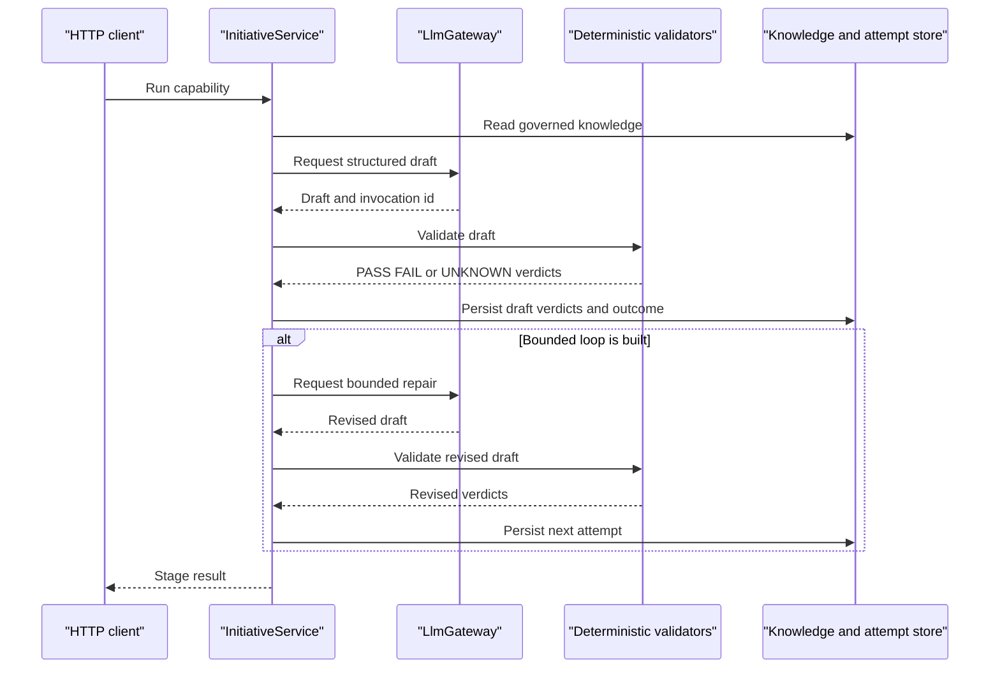

# Layer 2: Design capabilities

## 1. Purpose

The Design Capabilities layer recalls governed knowledge, analyses reuse,
checks data feasibility, drafts targeting and features, and designs
experiments. It is not responsible for warehouse execution, feature builds,
model training, evaluation, serving, or deployment.

## 2. Status

**BUILT but one-shot; agent loops are TO BUILD.** The deterministic judges and
four application call sites exist. No bounded repair-loop agent exists.

## 3. Components

| component | responsibility | implementing class/table | notes |
| --- | --- | --- | --- |
| Model Discovery | Register requirements, recall and rank governed candidates, explain results | `DiscoveryService`, `DiscoveryController`, `discovery_runs` | `POST /api/discovery/runs`; recall uses `EmbeddingProvider` |
| Reuse Intelligence | Score and classify reuse, adapt or generate | `DiscoveryService`, `DiscoveryWeights` | `POST /api/discovery/runs`; six gated dimensions must each reach `REUSE_THRESHOLD` `0.80` |
| Data Discovery | Resolve governed data assets and assess feasibility | `InitiativeService.finishFeasibility`, `KnowledgeService` | `POST /api/initiatives/{id}/stages/DATA_FEASIBILITY/run`; metadata only |
| Targeting Design | Draft cohort and optional label SQL | `InitiativeService`, `SqlDesignValidator` | `POST /api/initiatives/{id}/stages/TARGETING_DESIGN/run`; deterministic validators decide |
| Feature Intelligence | Draft features and check source, leakage, time and reuse | `InitiativeService.featureVerdicts` | `POST /api/initiatives/{id}/stages/FEATURE_DESIGN/run`; deterministic validation |
| Experiment Design | Validate variants, compute sample size and produce a decision rule | `InitiativeService.finishExperiment` | `POST /api/initiatives/{id}/stages/EXPERIMENT_DESIGN/run`; planning only |
| Bounded capability loop | Gather evidence, call judges, read verdicts and retry | TO BUILD | Every attempt must be persisted |

The four application call sites of `LlmGateway.complete` are
`ExtractionService.interpret`, `DiscoveryService.explanation`,
`InitiativeService.finishTargeting` and `InitiativeService.finishFeature`.
The extraction call is included here because the shared capability boundary is
used by this layer's design workflow.

## 4. Interfaces

Current HTTP routes:

```text
POST /api/discovery/requirements
POST /api/discovery/runs
GET  /api/discovery/runs/{id}
POST /api/initiatives/{id}/stages/{TARGETING_DESIGN|FEATURE_DESIGN|EXPERIMENT_DESIGN}/run
```

Discovery requirement shape is `ModelRequirement`:

```json
{
  "businessDomain": "string",
  "businessUseCase": "string",
  "predictionTarget": "string",
  "observableDefinition": "string",
  "population": "string",
  "outcomeHorizon": "string",
  "decisionLatency": "string",
  "requiredAction": "string",
  "constraints": {},
  "clientTaxonomy": {},
  "canonicalTaxonomy": {},
  "requiredObservables": [],
  "syntheticEvidenceAllowed": false
}
```

Run shape:

```json
{"requirementId": "uuid", "includeCandidates": false}
```

The proposed loop contract is explicitly TO BUILD:

```text
POST /api/capabilities/{capability}/loops
{"initiativeId":"uuid","input":{},"maxAttempts":3}
```

The response should contain `attempts[]`, each with `draft`, `verdicts`,
`outcome` and `attempt`, plus the final `status`. No such route exists today.

## 5. Data model

Discovery owns these append-only tables from `V5__discovery_and_embeddings.sql`:

| table | important columns and invariants |
| --- | --- |
| `discovery_requirements` | `id`, `client_id`, `requirement`, `created_at`; unique client-scoped id |
| `discovery_runs` | `id`, `client_id`, `requirement_id`, `include_candidates`, `weights`, `embedding_provider`, `result`, `created_at`; client-scoped foreign key and append-only trigger |

Design drafts, validator verdicts, blockers and artifacts are stored in the
JSONB columns of `initiative_stage_attempts`; the V12 migration adds
`generation_drafts`, `drafts_generated`, `drafts_rejected` and
`violated_checks`. Feature knowledge candidates use `knowledge_objects` and
their lifecycle rules.

The proposed capability ledger is not current schema:

```sql
create table capability_attempts (
  id uuid primary key,
  client_id uuid not null,
  initiative_id uuid not null,
  capability varchar(80) not null,
  attempt integer not null,
  input jsonb not null,
  draft jsonb not null,
  verdicts jsonb not null,
  outcome varchar(40) not null,
  created_at timestamptz not null default now(),
  unique (client_id, initiative_id, capability, attempt)
);
```

The proposed table must be insert-only, tenant-keyed and linked to the
initiative attempt that supplied the input.

## 6. Main path



## 7. Deterministic vs agent split

An agent may gather evidence, interpret requirements, draft SQL or features,
read validator output and retry within a fixed budget. Code decides similarity,
eligibility, access, the six reuse dimensions, `REUSE_THRESHOLD = 0.80`,
feasibility status, SQL safety, governed references, required projections,
leakage, point-in-time rules, variant validity and sample-size mathematics.
For later execution, statistical tests, acceptance thresholds and promotion
criteria remain deterministic; they are not implemented by this layer. The
model never decides a number, threshold or guard.

The evidence rule is policy, not yet enforced: an agent-supplied input without
an evidence citation resolves to `UNKNOWN` and reaches a human gate rather than
satisfying a threshold. `FieldProvenance` and `knowledge_conflicts` provide
existing storage primitives, not this policy enforcement.

## 8. Failure and refusal behaviour

- Discovery candidates can be `NOT_RECOMMENDED`, `GENERATE`, `REUSE` or `ADAPT`;
  blockers and recall floors are deterministic.
- Reuse below `0.80` becomes an adaptation or generation path; no LLM changes
  the score.
- Feasibility checks are `PASS`, `FAIL` or `UNKNOWN`; blockers yield `BLOCKED`,
  while unknown checks without blockers yield `AWAITING_APPROVAL`.
- `SqlDesignValidator` rejects non-SELECT or multi-statement SQL, unknown
  tables/columns, missing projections, unsafe time predicates and target
  leakage.
- Feature drafts fail on ungoverned source columns, observation windows,
  target leakage or invalid data-time declarations; missing declarations can
  be `UNKNOWN`.
- Missing required sample-size inputs produce unknown checks; invalid variants
  or allocations block experiment design.
- Provider refusal, schema failure or failed retry is represented by
  `LlmOutcome` and the initiative provider-failure path.

## 9. Tech stack

Built paths use Java 21, Spring Boot 3.4.5, Spring MVC, JDBC, PostgreSQL,
pgvector and JSqlParser 4.9. The gateway uses deterministic or OpenAI
adapters. Testcontainers 1.20.6 and JUnit 5 cover the Java implementation.
Future bounded loops may use Python 3.12 and optionally LangGraph, but only
inside a capability loop and through `LlmGateway`.

## 10. Open questions / risks

- The evidence policy needs a defined enforcement point and migration.
- Data Discovery cannot observe rows until Layer 3 supplies a warehouse seam.
- Experiment planning is present, but execution and evaluation are absent.
- String-based leakage checks may miss semantically equivalent spellings.
