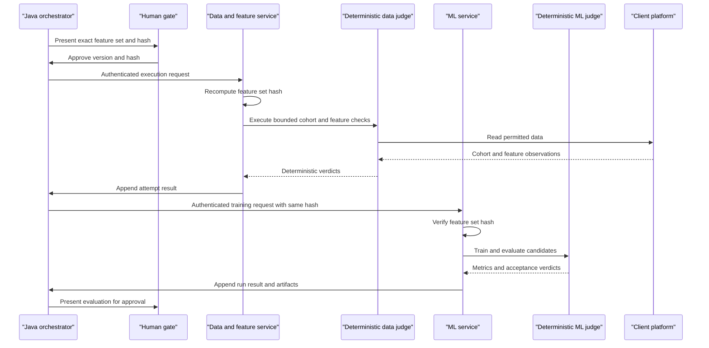

# Layer 3: Controlled execution services

## 1. Purpose

Controlled Execution Services will be the only layer that touches client data
rows or runs model-build workloads: one service executes data and feature work,
and one trains and evaluates models. They are not knowledge owners,
orchestrators of record, approval authorities, or places where thresholds and
promotion policy are improvised by an agent.

## 2. Status

**TO BUILD.** No data/feature execution service or ML execution service module
exists in this repository. The contracts below are implementation proposals.

## 3. Components

| component | responsibility | implementing class/table | notes |
| --- | --- | --- | --- |
| Data & Feature Agent | Profile data, propose features, refine candidates within a bounded loop | TO BUILD | Operates only after an approved design and permissions |
| Data & Feature Judge | Execute cohorts, build features, and check safety and quality | TO BUILD | Deterministic side owns access and limits |
| ML Build & Evaluation Agent | Propose algorithms, train, tune and explain runs | TO BUILD | Trains only the approved feature-set hash |
| ML Judge | Run training and evaluation and apply acceptance and promotion rules | TO BUILD | Deterministic metrics and gates |
| Feature-set approval | Approve an exact versioned feature set | TO BUILD | Hash binding makes approval meaningful |
| Python HTTP seam | Authenticate calls, carry idempotency and content hashes | TO BUILD | Append-only attempt records on both sides |

## 4. Interfaces

Proposed authenticated HTTP contracts:

```text
POST /v1/data-feature/attempts
POST /v1/ml/attempts
```

Data/feature request:

```json
{
  "initiativeId": "uuid",
  "requirementId": "uuid",
  "approvedFeatureSetId": "uuid",
  "approvedFeatureSetVersion": 3,
  "approvedFeatureSetHash": "sha256",
  "cohortSql": "approved design reference",
  "idempotencyKey": "sha256",
  "contentHash": "sha256"
}
```

ML request:

```json
{
  "initiativeId": "uuid",
  "featureSetId": "uuid",
  "featureSetVersion": 3,
  "featureSetHash": "sha256",
  "algorithms": ["algorithm-a"],
  "trainingConfig": {},
  "idempotencyKey": "sha256",
  "contentHash": "sha256"
}
```

Proposed responses use explicit codes:

```json
{
  "attemptId": "uuid",
  "status": "ACCEPTED|REJECTED|FAILED|COMPLETED",
  "contentHash": "sha256",
  "featureSetHash": "sha256",
  "verdicts": []
}
```

Authentication failure is `401`, forbidden capability is `403`, a hash
mismatch is `409 FEATURE_SET_HASH_MISMATCH`, invalid design is `422`, and a
replayed idempotency key returns the original result. These are TO BUILD
contracts, not current Model Studio routes.

The Java-to-Python seam must carry an authenticated service identity, client
scope, idempotency key, content hash, initiative id and immutable attempt
reference. Python may return observations; Java remains the authority for
thresholds, sample-size and promotion mathematics.

## 5. Data model

No Layer 3 tables exist. Proposed DDL:

```sql
create table approved_feature_sets (
  id uuid primary key,
  client_id uuid not null,
  initiative_id uuid not null,
  version integer not null,
  definition jsonb not null,
  content_hash varchar(128) not null,
  approved_gate_decision_id uuid not null,
  created_at timestamptz not null default now(),
  unique (client_id, initiative_id, version),
  unique (client_id, id, version, content_hash)
);

create table execution_attempts (
  id uuid primary key,
  client_id uuid not null,
  initiative_id uuid not null,
  service varchar(40) not null,
  idempotency_key varchar(128) not null,
  input_hash varchar(128) not null,
  feature_set_hash varchar(128),
  status varchar(40) not null,
  request jsonb not null,
  result jsonb,
  created_at timestamptz not null default now(),
  unique (client_id, service, idempotency_key)
);
```

Both tables require composite client foreign keys where they reference
initiative records. `execution_attempts` must be insert-only. An execution
service must recompute the feature-set hash from canonical content and reject
any mismatch before touching client data.

The current handoff precedent is `HandoffPackage.create`: recursively sort JSON
object keys, preserve array order, serialise compact UTF-8 JSON, and compute a
lowercase SHA-256. The approved feature set must use the same canonicalisation
rule. Store the resulting hash beside the approved version and in every
execution request. A mismatch is rejected as
`FEATURE_SET_HASH_MISMATCH`; no training or feature build starts.

## 6. Main path



## 7. Deterministic vs agent split

The Data & Feature Agent may profile, propose and refine within a budget. The
ML Build & Evaluation Agent may propose algorithms and explain runs. Judges
own query permissions, query limits, leakage and point-in-time correctness,
availability, quality thresholds, metrics, acceptance and promotion criteria.
The human gate approves the exact feature-set version and hash. Without that
binding, a later feature substitution would make the approval decorative.

## 8. Failure and refusal behaviour

- No approved feature-set hash or a mismatch returns
  `FEATURE_SET_HASH_MISMATCH` and touches no client data.
- Missing permission or exceeded query limit refuses before execution.
- Leakage, point-in-time, availability or quality failure returns deterministic
  verdicts and does not silently retry with a different feature set.
- A repeated idempotency key returns the append-only original attempt.
- Agent budget exhaustion returns unresolved work for human review.
- Training, evaluation or artifact failure remains a failed attempt; it cannot
  produce a `TESTED` or promoted model status by implication.

## 9. Tech stack

The proposed services use Python 3.12, FastAPI, pandas or Polars for data
work, scikit-learn, XGBoost and LightGBM for candidate algorithms, SHAP for
explanations, and MLflow for run and artifact tracking. Client platform SDKs
remain behind swappable adapters. Java 21 and Spring Boot retain ownership of
workflow, hashes, thresholds, sample-size and promotion policy.

## 10. Open questions / risks

- Exact client platform authentication and query isolation are unresolved.
- Feature-set canonicalisation needs a shared library and cross-language tests.
- Artifact retention and MLflow tenancy need governance.
- “Only place client data is touched” depends on adapters not bypassing this
  service.
