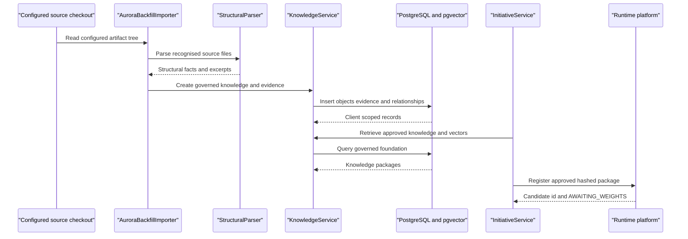

# Layer 4: Foundation

## 1. Purpose

The Foundation layer stores governed enterprise knowledge, evidence, provenance,
conflicts and embeddings, and provides seams to client estates. It is a
dependency for every layer above but does not choose a reuse outcome, approve a
gate, train a model or execute client data.

## 2. Status

**Enterprise Knowledge BUILT; client data and ML adapters TO BUILD.** The
knowledge module and schema are implemented. The source-artifact reader and
candidate-registration client are existing seams, not the client platform
adapter families shown in the conceptual diagram.

## 3. Components

| component | responsibility | implementing class/table | notes |
| --- | --- | --- | --- |
| Governed objects | Store typed, versioned knowledge | `KnowledgeObject`, `KnowledgeType`, `knowledge_objects` | Types are `MODEL`, `FEATURE`, `DATA_ASSET`, `IMPLEMENTATION`, `EXPERIMENT`, `STANDARD` |
| Evidence | Store source excerpts and versions | `KnowledgeEvidence`, `knowledge_evidence` | Evidence is linked with client-scoped foreign keys |
| Relationships | Link governed objects and evidence | `KnowledgeRelationship`, `knowledge_relationships` | Unique client-scoped relationship |
| Provenance | Explain field-level origin | `FieldProvenance`, `knowledge_field_provenance` | Supports `EVIDENCE_BACKED`, `ADAPTED`, `AI_GENERATED_HYPOTHESIS` |
| Conflicts | Record divergent governed values | `knowledge_conflicts`, `KnowledgeService` | `BLOCKING` and `DIVERGENT_DESCRIPTION` classes |
| Governance | Lifecycle and audit | `KnowledgeService`, `knowledge_audit` | Audit is append-only; approved object mutation is guarded |
| Human decisions | Store gate decisions separately | `initiative_gate_decisions` | Human decision records belong to orchestration but are governance knowledge |
| Embeddings | Store recall vectors | `KnowledgeEmbeddingWriter`, `knowledge_embeddings` | pgvector and provider label |
| Source-artifact seam | Read configured checkout artifacts in place | `AuroraBackfillImporter`, `StructuralParser` | Existing inbound seam |
| Candidate-registration seam | Post approved package to configured runtime platform | `AuroraCandidateClient`, `HttpAuroraCandidateClient` | One configured instance of a runtime-platform adapter |
| Client data adapters | Read-only query and capability probe | TO BUILD | Swappable pass-throughs for Athena, Snowflake, Databricks or Spark |
| Client ML adapters | Register and operate model artifacts | TO BUILD | Swappable pass-throughs for SageMaker, Databricks, Azure ML or Vertex |

## 4. Interfaces

Knowledge HTTP routes:

```text
POST /api/knowledge
POST /api/knowledge/{id}/submit-review
POST /api/knowledge/{id}/approve
POST /api/knowledge/{id}/deprecate
GET  /api/knowledge
GET  /api/knowledge/{id}
GET  /api/knowledge/{id}/evidence
GET  /api/knowledge/governance-rules
GET  /api/knowledge/{id}/impact
```

Discovery and initiative routes are owned by their layers, not duplicated here.
Every HTTP request requires `X-Aurora-Client`; `ClientScopeFilter` parses and
validates it against configured clients and places it in `ClientContext`.
This is client scoping, not a claim of complete tenant isolation.

`AuroraBackfillImporter.importRepository(Path)` reads a configured checkout in
place. `StructuralParser` recognises selected source formats. The outbound
`AuroraCandidateClient.register(String, Map<String,Object>, String)` sends a
content-hashed package through `HttpAuroraCandidateClient` with
`Idempotency-Key` and `X-Aurora-Studio-Token` to its configured URL. A
successful receiver must return a candidate id and `AWAITING_WEIGHTS`; this is
not a trained model.

Proposed client adapter interface:

```java
interface ClientDataAdapter {
  CapabilityReport probe();
  QueryResult executeReadOnly(QueryRequest request, QueryLimits limits);
}

interface ClientMlAdapter {
  CapabilityReport probe();
  ArtifactRegistration registerArtifact(ArtifactRequest request);
}
```

The adapters are pass-throughs: they report capabilities, enforce local
request limits and translate client APIs. They do not own governed knowledge
or decide promotion.

## 5. Data model

`V1__knowledge_foundation.sql` and later migrations define:

| table | important columns and invariants |
| --- | --- |
| `knowledge_objects` | `id`, `client_id`, `knowledge_key`, `version`, `knowledge_type`, names/descriptions, taxonomies, tags, `lifecycle_status`, effective dates, confidence, quality, approvers, `attributes`, `synthetic`; unique client/key/version and one approved version per key |
| `knowledge_evidence` | `id`, `client_id`, `knowledge_object_id`, source system/type/URI/version, excerpt, extraction certainty, timestamp |
| `knowledge_relationships` | `id`, `client_id`, from/to object ids, relationship type, evidence id; composite client foreign keys and unique relationship |
| `knowledge_conflicts` | `id`, `client_id`, object id, field, `values`, status, detection/resolution fields; conflict class added by V8 |
| `knowledge_audit` | `id`, `client_id`, object id, status transition, actor, comment, timestamp; update/delete rejected |
| `knowledge_field_provenance` | field name/value, provenance, citation evidence id/excerpt, extraction certainty |
| `knowledge_embeddings` | object id, `embedding vector(32)`, `embedding_provider`, timestamp; unique client/object |
| `initiative_gate_decisions` | actor, `actor_verified`, decision, reason and accepted unknown checks; append-only |

The knowledge lifecycle is `EXTRACTED` -> `PENDING_REVIEW` -> `APPROVED`, with
`SUPERSEDED` and `DEPRECATED` terminal alternatives. Approved object mutation
is restricted by `protect_approved_knowledge`; audit, invocation, discovery,
initiative and handoff records have append-only protections where defined.

The proposed adapter registry is not current schema:

```sql
create table client_adapter_bindings (
  id uuid primary key,
  client_id uuid not null,
  adapter_family varchar(40) not null,
  provider varchar(80) not null,
  configuration_ref varchar(200) not null,
  capabilities jsonb not null default '{}'::jsonb,
  created_at timestamptz not null default now(),
  unique (client_id, adapter_family, provider)
);
```

Configuration references must not contain credentials in this database.

## 6. Main path



## 7. Deterministic vs agent split

Agents may read governed evidence, propose interpretations and identify
conflicts. The foundation stores those claims and their provenance; it does
not decide whether a model is reusable or whether a gate is approved.
`ClientScopeFilter`, lifecycle checks, schema constraints, append-only triggers
and content hashes remain deterministic. Client adapters must pass observations
up to the execution judges without changing policy.

## 8. Failure and refusal behaviour

- Missing or unknown client header is HTTP 400.
- Invalid lifecycle transition raises `KnowledgeConflictException`; missing
  evidence raises `IllegalStateException` and blocks approval.
- Approved knowledge cannot be rewritten except through permitted supersede or
  deprecate transitions.
- Audit, invocation, discovery, initiative and handoff append-only triggers
  reject update or delete.
- Missing source artefact, malformed source or provider failure refuses the
  affected import or registration and records the outcome where supported.
- A candidate registration must return `AWAITING_WEIGHTS`; it is never treated
  as trained, evaluated, deployed or servable.
- Adapter permission, capability or query-limit failures must be returned as
  structured refusals once the adapters exist.

## 9. Tech stack

Built foundation components use Java 21, Spring Boot 3.4.5, Spring MVC, JDBC,
Flyway, PostgreSQL with pgvector, Springdoc OpenAPI, Testcontainers 1.20.6 and
JUnit 5. `AuroraBackfillImporter` uses SnakeYAML and Jackson. Future client
adapters should use authenticated HTTP or vendor SDKs behind the proposed
interfaces; they must not move governance into provider-specific code.

## 10. Open questions / risks

- The current client scope header is not an authenticated tenant identity.
- Embeddings are `vector(32)` and the schema lacks dimension/model-version
  columns for safe mixed providers.
- Adapter credential storage and capability caching need a deployment design.
- The economic boundary is deliberate: governed knowledge is ours and compounds
  across initiatives; adapter connections belong to the client's estate and do
  not compound.
