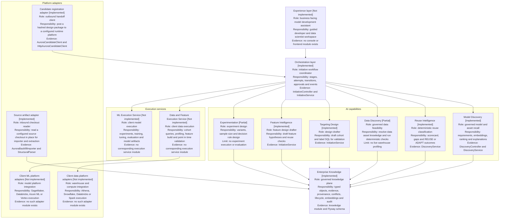
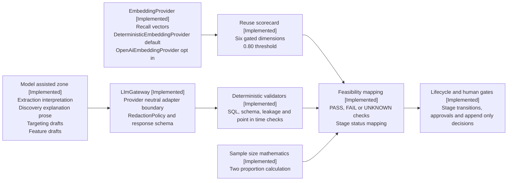
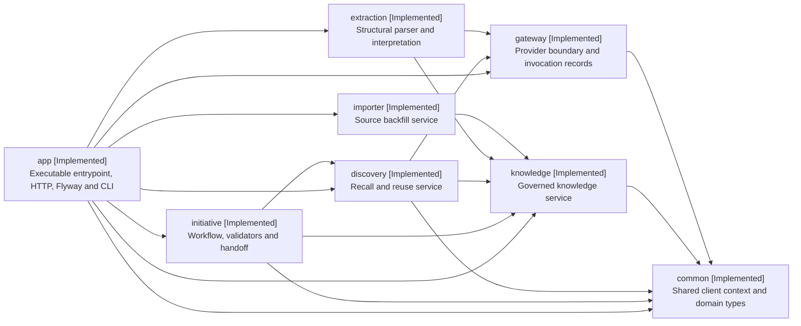
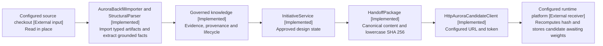

# Aurora Model Studio platform map

This document is the platform map for Aurora Model Studio. It uses the same
layer names and lifecycle vocabulary as the conceptual model, but every
implementation statement below is grounded in this repository.

## 1. What Model Studio is and is not

Model Studio is a design and governance plane for model development. It:

- governs versioned knowledge, evidence, provenance, conflicts, and lifecycle;
- orchestrates initiative stages and explicit human-gated decisions;
- drafts targeting, feature, and experiment designs from governed material;
- emits an approved, immutable, content-hashed design package.

Model Studio does not train, evaluate, deploy, serve, or monitor models. It does
not own client profiles. It does not execute client warehouse queries or feature
builds, and it does not claim that an untrained candidate is a tested model.

The client estate remains the source of client-owned profile and event data.
Model Studio stores the governed knowledge and design records needed to reason
about development; it is not a replacement system of record.

## 2. Capability layers

The labels in this diagram use a consistent status suffix:

- **Implemented** means a corresponding class, module, endpoint, persistence
  path, or configuration exists in this repository.
- **Partial** means the repository implements a narrower capability than the
  conceptual label suggests.
- **Not implemented** means no corresponding execution service or experience
  exists in this repository.

### Experience layer

There is no console or business-facing frontend in the Model Studio repository.
The runtime exposes Spring MVC controllers, and `ImporterCommand` provides
CLI-style import, extraction, embedding backfill, approval, and initiative
seeding runs. The platform therefore has an HTTP API and operational command
line entry points, but not the single assistant experience shown in the
conceptual picture.

### Orchestration and AI capabilities

`InitiativeController` and `InitiativeService` implement the governed workflow.
`DiscoveryController` and `DiscoveryService` implement requirement registration,
recall, ranking, scorecards, and explanation prose. Data Discovery is deliberately
narrower than live data discovery: `DATA_ASSET` knowledge is retrieved and
`InitiativeService` performs feasibility checks over declared metadata. It does
not profile a warehouse or build a cohort.

Targeting and feature capabilities draft structured designs and run deterministic
checks. Experimentation is also a design capability: it validates variants,
derives sample size, and writes a decision rule. None of these paths trains a
model or executes an experiment.

### Enterprise Knowledge

The knowledge module represents `MODEL`, `FEATURE`, `DATA_ASSET`,
`IMPLEMENTATION`, `EXPERIMENT`, and `STANDARD` objects. It records evidence,
field-level provenance, relationships, conflicts, confidence, lifecycle state,
and embeddings. Only approved knowledge is trusted by default. Candidate
knowledge is visible only when callers opt in with `includeCandidates=true`.

### Execution and adapters

The repository contains deterministic validators for proposed SQL and feature
metadata, but those validators are not a Data and Feature Execution Service.
There is no ML execution service, training runtime, model artifact store, or
client platform adapter in this codebase. The two implemented adapter seams are
the inbound source-checkout reader and the outbound candidate-registration
client.

## 3. Lifecycle

### Model Studio stages

The source enum defines these nine stages in this order:

1. `REQUIREMENT_INTAKE`
2. `KNOWLEDGE_DISCOVERY`
3. `REUSE_DECISION`
4. `DATA_FEASIBILITY`
5. `TARGETING_DESIGN`
6. `FEATURE_DESIGN`
7. `CANDIDATE_BUILD`
8. `EXPERIMENT_DESIGN`
9. `HANDOFF`

`CANDIDATE_BUILD` is initialized as `OUT_OF_SCOPE` by
`InitiativeRepository.create` and cannot be run. `EXPERIMENT_DESIGN` follows
`FEATURE_DESIGN` directly in `InitiativeService.predecessor`; the out-of-scope
candidate stage is not a hidden training step.

```mermaid
flowchart LR
  intake["REQUIREMENT_INTAKE [Implemented]<br/>Completed when initiative is created"]
  discovery["KNOWLEDGE_DISCOVERY [Implemented]<br/>Discovery run or BLOCKED"]
  reuse["REUSE_DECISION [Implemented]<br/>AWAITING_APPROVAL"]
  feasibility["DATA_FEASIBILITY [Implemented]<br/>PASS, FAIL or UNKNOWN checks"]
  targeting["TARGETING_DESIGN [Implemented]<br/>Structured SQL drafts and validators"]
  features["FEATURE_DESIGN [Implemented]<br/>Structured feature drafts and validators"]
  build["CANDIDATE_BUILD [Out of scope]<br/>No training or candidate build"]
  experiment["EXPERIMENT_DESIGN [Implemented]<br/>Deterministic design and sample size"]
  handoff["HANDOFF [Implemented]<br/>Hashed package and approval"]

  intake --> discovery --> reuse --> feasibility --> targeting --> features --> build --> experiment --> handoff
```

### Human gates and outcomes

The human-gated set in `InitiativeService.GATED_STAGES` is:
`REUSE_DECISION`, `DATA_FEASIBILITY`, `TARGETING_DESIGN`, `FEATURE_DESIGN`,
`EXPERIMENT_DESIGN`, and `HANDOFF`.

The gate endpoint accepts `APPROVE`, `REJECT`, or `RETURN`, plus a named actor
and a non-empty reason. Approval decisions for stages with `UNKNOWN` feasibility
checks must name every unknown check in `acceptedUnknownChecks`. The API writes
`actor_verified=false` and exposes `actorIdentityVerified:false`; the actor
identity is caller-asserted, not authenticated.

| Stage | Producer behavior | Human decision behavior |
| --- | --- | --- |
| `REQUIREMENT_INTAKE` | Completed during initiative creation | No gate |
| `KNOWLEDGE_DISCOVERY` | Discovery completes or blocks on `NO_RECALL_CANDIDATE` | No gate |
| `REUSE_DECISION` | Always becomes `AWAITING_APPROVAL` | `APPROVE` completes, `REJECT` rejects, `RETURN` returns to `PENDING` |
| `DATA_FEASIBILITY` | `BLOCKED` on failed blockers, `AWAITING_APPROVAL` on unknowns, otherwise `COMPLETED` | Approval of unknowns requires the complete unknown-check list |
| `TARGETING_DESIGN` | Provider failure becomes `PROVIDER_FAILED`; drafts are schema-checked and SQL-validated | A stage with unknown validator results awaits approval; otherwise valid output can complete |
| `FEATURE_DESIGN` | Provider failure becomes `PROVIDER_FAILED`; drafts are checked for governed columns, leakage, point-in-time semantics, and reuse | A stage with unknown validator results awaits approval; otherwise valid output can complete |
| `CANDIDATE_BUILD` | Initialized as `OUT_OF_SCOPE` | Cannot be run or approved |
| `EXPERIMENT_DESIGN` | Deterministically validates variants and sample-size inputs; unknown inputs await approval | Approval of unknowns requires the complete unknown-check list |
| `HANDOFF` | Preconditions produce a package and always await approval, or become `BLOCKED` | Approval verifies the package hash, then attempts registration |

Each run records a `StageAttempt` and `InitiativeEvent`. Gate decisions are
separate append-only records. A known orchestrator identity is prevented from
approving the gate it created, but arbitrary caller-supplied names are not
verified.

### Mapping the conceptual eleven-stage lifecycle

| Conceptual stage | Model Studio mapping | Implementation note |
| --- | --- | --- |
| 1. Requirement Understanding | `REQUIREMENT_INTAKE` | Requirement is registered while the initiative is created |
| 2. Similar Model Discovery | `KNOWLEDGE_DISCOVERY` | Discovery retrieves and ranks governed candidates |
| 3. Reference Selection | `KNOWLEDGE_DISCOVERY` | No separate stage; this stage absorbs discovery and reference selection |
| 4. Reuse Analysis | `REUSE_DECISION` | Human decision over the discovery result |
| 5. Data Discovery | `DATA_FEASIBILITY` | Governed metadata feasibility, not live warehouse profiling |
| 6. Target or Cohort Design | `TARGETING_DESIGN` | Structured cohort and optional label SQL drafts |
| 7. Feature Discovery and Design | `FEATURE_DESIGN` | Feature drafts, validation, and reuse-before-creation checks |
| 8. Experiment Design | `EXPERIMENT_DESIGN` | Variants, sample-size mathematics, and decision rule |
| 9. Model Build and Evaluation | No counterpart | `CANDIDATE_BUILD` is `OUT_OF_SCOPE`; Model Studio does not train or evaluate |
| 10. Candidate Approval | No counterpart in the trained sense | There is no trained candidate to approve; handoff approval is for the design package |
| 11. Model Handoff Package | `HANDOFF` | Named human approval precedes outbound registration |

The source enum places `CANDIDATE_BUILD` before `EXPERIMENT_DESIGN`, but the
orchestrator's predecessor logic skips that out-of-scope stage when starting
experiment design. That source-level detail is why the table does not imply a
training phase.

## 4. AI and deterministic boundary

There are four main-code `LlmGateway.complete` calls:

1. `ExtractionService`: grounded interpretation of a parsed artifact;
2. `DiscoveryService`: explanation prose for a deterministic scorecard and its
   evidence;
3. `InitiativeService`: targeting design drafts;
4. `InitiativeService`: feature design drafts.

`GatewayService` validates the response schema, records the invocation in
`llm_invocations`, retries retryable failures, and returns outcomes such as
`OK`, `REFUSED`, `SCHEMA_INVALID`, or `FAILED`. A provider failure in a design
stage becomes `PROVIDER_FAILED`; there is no deterministic fallback that silently
replaces a failed provider result.

Discovery recall uses the separate `EmbeddingProvider` interface, not
`LlmGateway`. `DeterministicEmbeddingProvider` is the default and emits
`deterministic-v1` vectors with 32 dimensions. `OpenAiEmbeddingProvider` is
selected only when `studio.discovery.embedding-provider=openai` and an API key
is available. The LLM provider is separately configured through
`studio.llm.provider`, defaulting to the deterministic adapter.

The reuse scorecard records eight values, but its reuse decision is gated by
these six structural dimensions:

- `targetAlignment`;
- `populationAlignment`;
- `horizonAlignment`;
- `featureAvailability`;
- `dataAvailability`;
- `implementationAvailability`.

Every one of those six dimensions must be present and at least `0.80` for
`clearsReuse` to pass. The scorecard also records `evidenceStrength` and
`executionEvidence`. `evidenceStrength` is weighted and recorded, but it is
not one of the six gated dimensions.

Feasibility checks are deterministic mappings over governed knowledge and
declared requirements. Missing or invalid facts produce `FAIL`; facts that
cannot be compared produce `UNKNOWN`; known valid facts produce `PASS`.
Unknowns can reach a human gate only when the caller explicitly accepts the
complete named set. SQL validation uses `SqlDesignValidator` and covers
read-only parsing, governed table and column references, explicit projections,
label contracts, and point-in-time predicates. Feature validation covers
governed source columns, observation windows, target leakage, and declared
point-in-time availability. Experiment design validates variant roles, names,
allocations, and exposure inputs, then calculates a two-proportion sample size
when the governed inputs are present.

**The model never decides a number, a threshold, or a guard.** Thresholds,
validator rules, feasibility mappings, sample-size mathematics, lifecycle
transitions, and human gate outcomes are deterministic code paths.

## 5. Interfaces and operations

### HTTP surface

All routes pass through `ClientScopeFilter`. A request must supply a known UUID
in `X-Aurora-Client`; the filter sets `ClientContext` for the request and clears
it afterward. This is client scoping in the Model Studio API, not a claim that
the external runtime platform provides tenant isolation.

| Controller | Method and path | Responsibility |
| --- | --- | --- |
| `KnowledgeController` | `POST /api/knowledge` | Create extracted or drafted knowledge |
| `KnowledgeController` | `POST /api/knowledge/{id}/submit-review` | Submit knowledge for review |
| `KnowledgeController` | `POST /api/knowledge/{id}/approve` | Approve evidence-backed knowledge |
| `KnowledgeController` | `POST /api/knowledge/{id}/deprecate` | Deprecate approved or pending knowledge |
| `KnowledgeController` | `GET /api/knowledge` | Search knowledge, approved by default |
| `KnowledgeController` | `GET /api/knowledge/{id}` | Read a knowledge package |
| `KnowledgeController` | `GET /api/knowledge/{id}/evidence` | Read source evidence |
| `KnowledgeController` | `GET /api/knowledge/governance-rules` | Read governance rules |
| `KnowledgeController` | `GET /api/knowledge/{id}/impact` | Analyze relationship impact |
| `DiscoveryController` | `POST /api/discovery/requirements` | Register a model requirement |
| `DiscoveryController` | `POST /api/discovery/runs` | Run discovery and reuse analysis |
| `DiscoveryController` | `GET /api/discovery/runs/{id}` | Read a discovery run |
| `InitiativeController` | `POST /api/initiatives` | Create an initiative |
| `InitiativeController` | `GET /api/initiatives` | List client-scoped initiatives |
| `InitiativeController` | `GET /api/initiatives/{id}` | Read an initiative |
| `InitiativeController` | `POST /api/initiatives/{id}/stages/{stage}/run` | Run a stage |
| `InitiativeController` | `POST /api/initiatives/{id}/stages/{stage}/decision` | Record a gate decision |
| Actuator | `GET /actuator/health` | Read health, also requiring client context |

There are no gateway, extraction, or importer controllers. Their operations
are reached by service orchestration or by the `ImporterCommand`
`CommandLineRunner`, including `--import`, `--extract`, `--extract-synthetic`,
`--backfill-embeddings`, `--seed-initiatives`, and related approval and source
checkout options. Thus the repository has no console, but it does have
CLI-style operational runs in addition to HTTP.

### Runtime and module stack

| Concern | Implementation |
| --- | --- |
| Language | Java 21 |
| Web runtime | Spring Boot 3.4.5 and Spring MVC |
| Application port | `8081` |
| Database | PostgreSQL with pgvector on host port `5433` |
| Persistence | JDBC |
| Schema management | Flyway |
| LLM boundary | Provider-neutral `LlmGateway` |
| Tests | Testcontainers 1.20.6 and JUnit 5 |
| HTTP documentation | Springdoc OpenAPI dependency |
| Maven modules | `common`, `gateway`, `knowledge`, `importer`, `extraction`, `discovery`, `initiative`, `app` |

The root `pom.xml` is the Maven reactor aggregator. `app` is the executable
Spring Boot entrypoint and runtime assembler. The declared direct dependency
direction is:

`common` has no product-module dependency. It is a direct dependency of
`gateway`, `knowledge`, `discovery`, `initiative`, and `app`; `importer` and
`extraction` receive it transitively. Therefore “everything depends on
`common`” is true transitively, not as eight direct POM edges.

## 6. External seams

Model Studio has two external seams. Neither seam turns Model Studio into a
training, serving, or client-profile system.

### Inbound source-artifact adapter

`AuroraBackfillImporter.importRepository(Path)` reads a configured checkout
in place. It imports typed features, implementations, models, data assets,
policies, standards, and their evidence. `StructuralParser` reads selected
YAML, SQL, Java, and Markdown files for extraction. The importer records source
paths, file hashes, and the resolved Git commit as evidence; it does not copy
source files into this repository and does not represent a hosted
source-control integration.

### Outbound candidate-registration adapter

`AuroraCandidateClient` and `HttpAuroraCandidateClient` post an approved design
package to a configured runtime-platform URL using
`studio.handoff.aurora-base-url` and `studio.handoff.aurora-token`. The client
also sends the package hash as `Idempotency-Key` and authenticates the request
with `X-Aurora-Studio-Token`.

`HandoffPackage` recursively sorts JSON object keys, preserves array order,
serializes compact UTF-8 JSON, and computes a lowercase SHA-256 hash. The
package content includes `clientId` provenance before hashing. The transport
envelope fields `studioInitiativeId` and `packageHash` are added after the
content hash is computed and are deliberately excluded from that calculation.
The configured runtime platform recomputes the hash server-side. Replaying the
same package hash is idempotent at the receiving seam.

The successful receiver contract returns a candidate identifier and
`AWAITING_WEIGHTS`. This is a candidate design registration, not a model
version. Model Studio supplies no weights, evaluation, expected lift, or causal
result.

The adapter records these outcomes:

| Outcome | Meaning |
| --- | --- |
| `AURORA_NOT_CONFIGURED` | The local outbound token is absent; no anonymous request is made |
| `AURORA_UNREACHABLE` | The configured runtime platform could not be reached |
| `AURORA_REJECTED` | The runtime platform returned a non-201 response, with its HTTP status recorded |
| `AURORA_RESPONSE_INVALID` | A successful response was malformed or lacked the required candidate response |

Remote authentication failures and service-unavailable responses are therefore
recorded as `AURORA_REJECTED` with their HTTP status. A successful response
that does not contain a candidate identifier and `AWAITING_WEIGHTS` is
`AURORA_RESPONSE_INVALID`.

### Embedding storage limitation

`knowledge_embeddings.embedding` is `vector(32)`, matching the deterministic
provider. The opt-in OpenAI embedding implementation returns the configured
OpenAI model's vector, whose standard `text-embedding-3-small` size is 1536,
so switching providers requires a compatible schema and deployment decision.
The table records `embedding_provider`, but has no embedding-dimension or
model-version column; mixed provider dimensions cannot be made safe by the
current schema alone.

## Honest limits

- Governance actors are caller-asserted and unverified. The API discloses
  `actorIdentityVerified:false`; the exact machine identity check only blocks
  the known orchestrator from approving the gate it created.
- The database gate trigger checks the session setting
  `aurora.initiative_gate_actor` that the API sets. This defends against
  accidental machine writes through the normal API path, not a database-capable
  adversary who can forge the setting.
- `CANDIDATE_BUILD` is explicitly `OUT_OF_SCOPE`.
- Model Studio has no training, evaluation, deployment, serving, monitoring,
  or client-owned model lifecycle implementation. Client MLOps owns those
  responsibilities after handoff.
- The current leakage validator is string-based. Human-readable event
  spellings can produce a false negative when the target is represented in a
  spelling the validator does not match.

For detail, see [the knowledge model](knowledge-model.md), [extraction](extraction.md),
[discovery](discovery.md), [the LLM gateway](llm-gateway.md),
[targeting and feature design](targeting-feature-design.md), and
[experiment design and handoff](experiment-design-and-handoff.md). The
[handoff contract](handoff-contract.md) and
[handoff walkthrough](handoff-walkthrough.md) contain the focused seam
walkthroughs.
