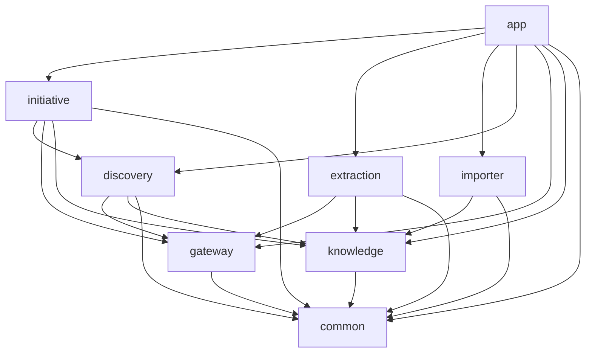

# Module architecture

Model Studio is a modular Spring Boot application. The Maven artifacts provide
build boundaries; `ModuleArchitectureTest` verifies the dependencies between
their production Java packages during `mvn verify`.

## Dependency direction

Arrows point from a consumer to a dependency. `app` assembles all modules.

| Module | Responsibility | Entry points and contracts |
| --- | --- | --- |
| `common` | Client context, shared identifiers and errors | `ClientContext`, shared enums and exceptions |
| `gateway` | Provider calls, response validation and invocation audit | `LlmGateway`, `LlmRequest`, `LlmResult` |
| `knowledge` | Knowledge lifecycle, provenance, relationships and storage | `KnowledgeService`, `KnowledgeIngestion`, `KnowledgeSearchIndex`, `KnowledgeEmbeddingWriter` |
| `importer` | Backfill from an Aurora source checkout | `AuroraBackfillImporter` |
| `extraction` | Parse and interpret source artifacts into knowledge candidates | `ExtractionService` |
| `discovery` | Requirements, retrieval, reuse ranking and embeddings | `DiscoveryService` |
| `initiative` | Stage sequencing, approvals, design and handoff | `InitiativeService`, `AuroraCandidateClient` |
| `app` | Spring Boot composition, configuration, migrations and CLI | `ModelStudioApplication`, `ImporterCommand` |

Controllers remain beside the domain services they expose. No module depends on
`app`, and no module may depend on another module's repository class or its nested
row types. The importer must not depend on JDBC. Cross-module tests live in `app`,
where the complete reactor is available; production boundary rules exclude tests.

## Knowledge access

Consumers choose a contract by capability:

- `KnowledgeService` owns governed writes, lifecycle decisions, evidence,
  relationships and read packages. `link` validates that both endpoints exist in
  the current client context, inserts an edge idempotently, and runs in a
  transaction. `relatedObjectIds` returns outgoing edges of the requested type.
- `KnowledgeIngestion` provides latest-version lookup, source-version
  deduplication and field provenance for importer/extraction.
- `KnowledgeSearchIndex` provides discovery recall and embedding persistence.
  It does not expose lifecycle mutation.
- `KnowledgeEmbeddingWriter` is the callback implemented by discovery for
  knowledge changes. Knowledge depends on this local interface, so it does not
  acquire a reverse dependency on discovery.

`KnowledgeRepository` implements the ingestion and search contracts inside
`knowledge`. SQL, tenant predicates and row mapping remain there. External
consumers inject interfaces or `KnowledgeService`; they do not inject the
repository. Existing repository-based test doubles still satisfy the interfaces.

## Initiative internals

`InitiativeService` is the public workflow facade. It owns creation, stage
preconditions, retries, human gate decisions and transaction boundaries. Its
stage producers and read-model assembly are package-private Spring components:

| Component | Responsibility |
| --- | --- |
| `InitiativeQueries` | Assemble initiatives, attempts, decisions, events and durations |
| `InitiativeKnowledge` | Resolve observables and data assets; traverse blocking conflicts |
| `FeasibilityStage` | Check required knowledge, metadata, grain, cadence and history |
| `GeneratedDesignStage` | Produce targeting/feature drafts through the gateway and validate them |
| `ExperimentDesignStage` | Validate allocations and calculate sample size and decision rules |
| `HandoffStage` | Check prerequisites, hash the design package and register it with Aurora |
| `DesignPayloads`, `StageTiming` | Shared payload conversion and timing helpers |

Producers do not call `InitiativeService` or one another. They read through
`InitiativeQueries` and share graph traversal through `InitiativeKnowledge`.
They execute within the facade's transaction, preserving the existing ordering
of attempts, audit events and human approvals. No new asynchronous execution or
transaction propagation is introduced.

Public construction overloads remain available for existing callers and tests;
Spring uses the constructor that receives the focused components. The facade
retains a small package-building delegate for existing reflective tests.

## Making changes

1. Put behavior in its owning module and extend a capability contract when
   another module needs it. Keep repository access within that module.
2. Add direct Maven dependencies for modules whose types are used directly.
3. Extend the relevant stage component when changing initiative behavior;
   change the facade only for workflow or approval policy.
4. Run `mvn -B verify` from the repository root. This runs Spotless, Java 21
   compilation, unit tests, architecture rules and the Docker-backed PostgreSQL
   integration tests when Docker is available.

The architecture rules fail on cross-module repository dependencies, forbidden
layer dependencies, module cycles and importer JDBC access. Changing the allowed
dependency graph requires an explicit update to both this document and the
architecture test.
